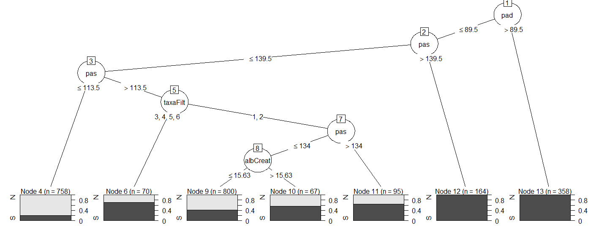
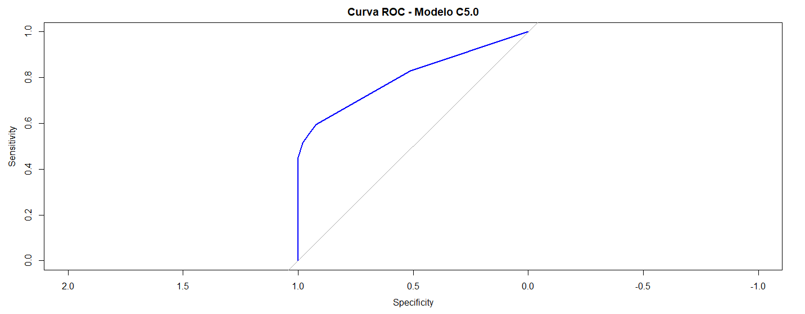
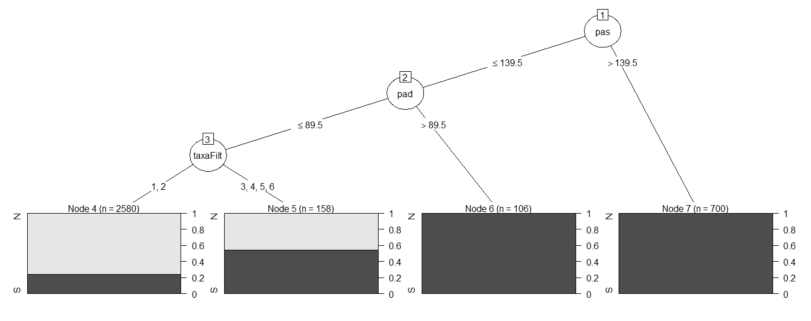
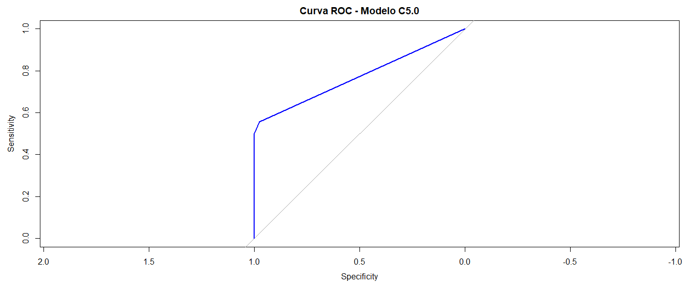
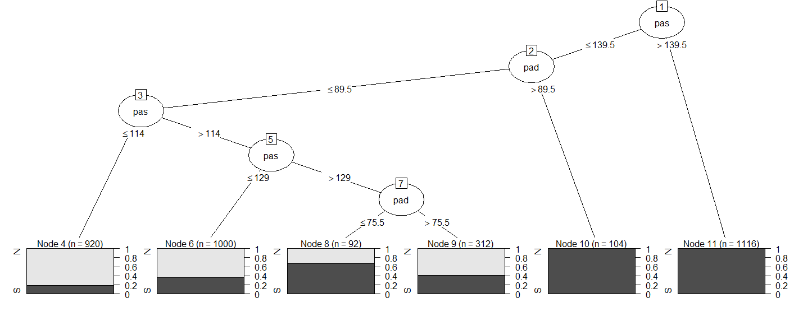
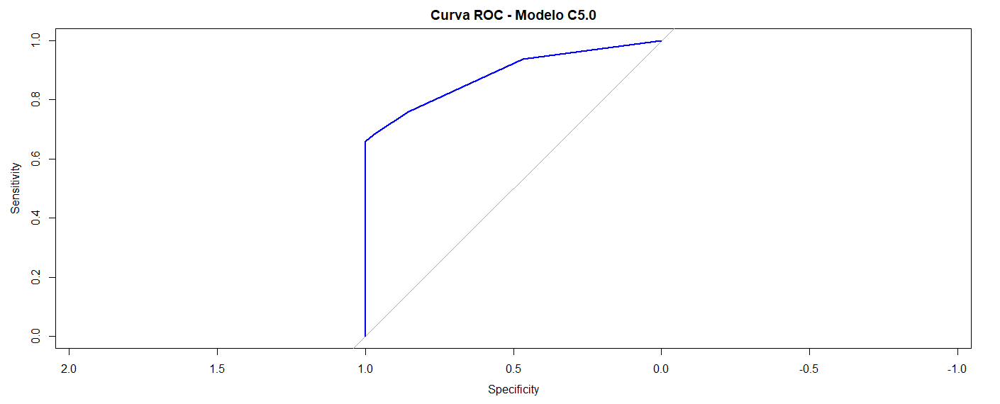
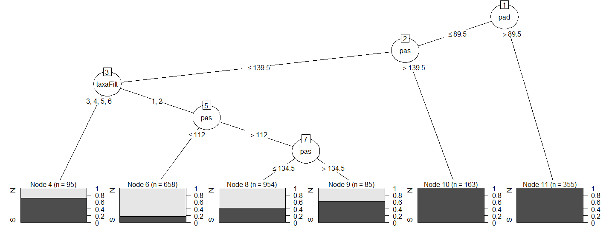
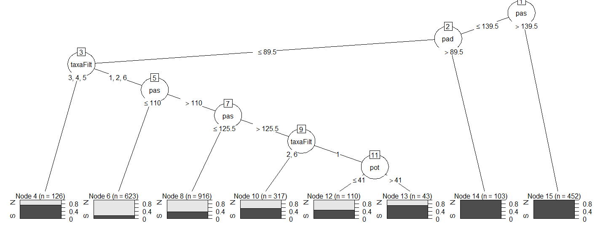
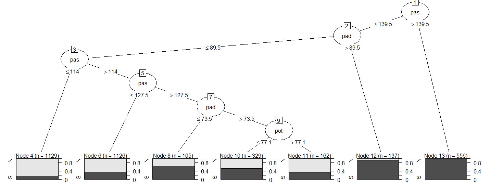
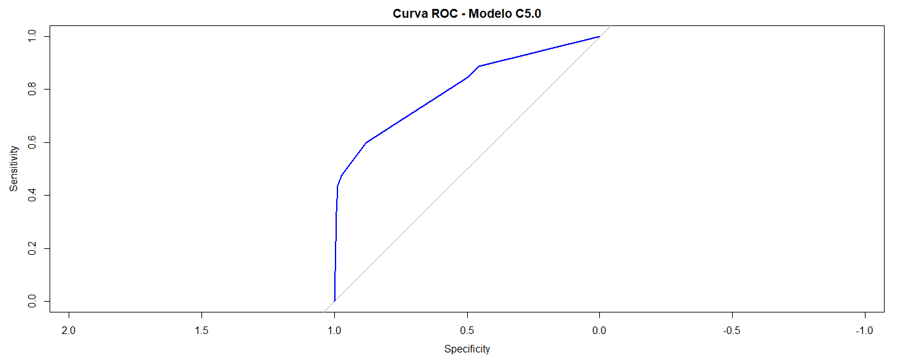

# Summary

- [Inference Tree Analysis Results (kNN)](#inference-tree-analysis-results-knn)
- [Inference Tree Analysis Results (pmm)](#inference-tree-analysis-results-pmm)
- [kNN](#kNN)
- [pmm](#pmm)

# Inference Tree Analysis Results (kNN)

### Wave 1 

#### Original Class Distribution
| Class | Count |
|-------|-------|
| 0     | 3410  |
| 1     | 1651  |

#### Class Distribution After Undersampling
| Class | Count |
|-------|-------|
| N (0) | 1651  |
| S (1) | 1651  |

#### Summary Statistics of Key Predictors

| Variable    | Description         | Min    | 1st Qu | Median | Mean   | 3rd Qu | Max    | Categories       |
|-------------|---------------------|--------|--------|--------|--------|--------|--------|------------------|
| **pot**     | Potassium intake     | 4.00   | 20.00  | 29.00  | 32.52  | 41.00  | 144.00 |                  |
| **sod**     | Sodium intake        | 9.00   | 69.00  | 101.00 | 109.30 | 144.00 | 327.00 |                  |
| **albCreat**| Albumin–Creatinine   | 1.83   | 5.09   | 6.60   | 19.61  | 8.59   | 5014.83 |                  |
| **pas**     | Systolic BP          | 77.00  | 108.00 | 118.00 | 119.80 | 129.00 | 219.50 |                  |
| **pad**     | Diastolic BP         | 44.50  | 67.50  | 74.50  | 75.19  | 82.00  | 131.50 |                  |
| **taxaFilt**| GFR class (taxaFilt) | 1 (1959), 2 (2864), 3 (200), 4 (25), 5 (7), 6 (6) | | | | | | |

#### Train/Test Split
- **Train:** 1982 observations × 7 variables  
- **Test:** 1320 observations × 7 variables  

#### Prediction Distribution
| Predicted | True N | True S |
|-----------|--------|--------|
| N         | 456    | 200    |
| S         | 39     | 295    |

- **Accuracy:** 0.7586
- **95% CI:** (0.7307, 0.7849)
- **Kappa:** 0.5172  
- **Precision** (Pos Pred Value for S): 0.8832
- **Sensitivity** (Recall for S): 0.5960            
- **Specificity:** 0.9212               
- **Balanced Accuracy:** 0.7586
- **Area under the curve:** 0.8018  

### Wave 2

#### Inference Tree Analysis Results

#### Original Class Distribution
| Class | Count |
|-------|-------|
| 0     | 2893  |
| 1     | 2168  |

#### Summary Statistics of Key Predictors
| Variable    | Description         | Min    | 1st Qu | Median | Mean   | 3rd Qu | Max      |
|-------------|----------------------|--------|--------|--------|--------|--------|----------|
| **pot**     | Potassium intake      | 1.50   | 22.00  | 29.00  | 33.93  | 43.00  | 167.00   |
| **sod**     | Sodium intake         | 5.00   | 70.00  | 109.00 | 108.10 | 140.00 | 303.00   |
| **albCreat**| Albumin–Creatinine    | 0.000  | 5.630  | 7.395  | 24.353 | 10.380 | 23049.850|
| **taxaFilt**| GFR class (counts)    | 1 (1614), 2 (3163), 3 (234), 4 (37), 5 (7), 6 (6) | | | | | |
| **pas**     | Systolic BP           | 72.50  | 110.00 | 121.50 | 124.90 | 134.50 | 223.50   |
| **pad**     | Diastolic BP          | 44.00  | 69.00  | 76.50  | 77.46  | 85.00  | 122.50   |
 

#### Prediction Distribution
| Predicted | True N | True S |
|-----------|--------|--------|
| N         | 847    | 288    |
| S         | 20     | 362    |

- **Accuracy:** 0.797
- **95% CI:** (0.7758, 0.8169)
- **Kappa:** 0.5629  
- **Precision** (Pos Pred Value for S): 0.9476 
- **Sensitivity** (Recall for S): 0.5569            
- **Specificity:** 0.9769               
- **Balanced Accuracy:** 0.7669 
- **Area under the curve:** 0.7727  

### Wave 3

#### Original Class Distribution
| Class | Count |
|-------|-------|
| 0     | 2276  |
| 1     | 2785  |

#### Summary Statistics of Key Predictors
| Variable    | Description         | Min    | 1st Qu | Median | Mean   | 3rd Qu | Max    |
|-------------|----------------------|--------|--------|--------|--------|--------|--------|
| **pot**     | Potassium intake      | 6.70   | 48.30  | 59.05  | 63.68  | 77.60  | 226.50 |
| **sod**     | Sodium intake         | 10.00  | 86.00  | 125.00 | 116.90 | 140.50 | 292.00 |
| **pas**     | Systolic BP           | 70.00  | 114.00 | 127.00 | 132.20 | 150.00 | 223.00 |
| **pad**     | Diastolic BP          | 48.00  | 71.50  | 79.50  | 79.63  | 91.00  | 133.00 |

 #### Prediction Distribution
| Predicted | True N | True S |
|-----------|--------|--------|
| N         | 657    | 261    |
| S         | 25     | 574    |

- **Accuracy:** 0.8115  
- **95% CI:** (0.7909, 0.8309)  
- **Kappa:** 0.6308  
- **Sensitivity** (Recall for S): 0.6874  
- **Specificity:** 0.9633  
- **Precision** (Pos Pred Value for S): 0.9583    
- **Balanced Accuracy:** 0.8254
- **Area under the curve:** 0.8851  

--------------------------------------------------------------------------------------------------------------------------------------------

# Inference Tree Analysis Results (pmm)

### Wave 1

#### Inference Tree Analysis Results 

#### Original Class Distribution
| Class | Count |
|-------|-------|
| 0     | 3411  |
| 1     | 1650  |

#### Distribution After Undersampling
| Class | Count |
|-------|-------|
| 0     | 1650  |
| 1     | 1650  |

#### Summary Statistics of Key Predictors
| Variable    | Description         | Min    | 1st Qu | Median | Mean   | 3rd Qu | Max    |
|-------------|----------------------|--------|--------|--------|--------|--------|--------|
| **pot**     | Potassium intake      | 4.00   | 20.00  | 29.00  | 32.63  | 41.00  | 144.00 |
| **sod**     | Sodium intake         | 9.00   | 68.00  | 102.00 | 109.70 | 145.00 | 327.00 |
| **albCreat**| Albumin–Creatinine    | 1.83   | 5.07   | 6.60   | 19.70  | 8.63   | 5014.83|
| **taxaFilt**| GFR class (frequencies)| 1 (1959), 2 (2864), 3 (200), 4 (25), 5 (7), 6 (6) | - | - | - | - | - |
| **pas**     | Systolic BP           | 77.00  | 108.00 | 118.00 | 119.80 | 129.00 | 219.50 |
| **pad**     | Diastolic BP          | 44.50  | 67.50  | 74.50  | 75.19  | 82.00  | 131.50 |

#### Evaluation Metrics
- **Accuracy:** 0.7566
- **Kappa:** 0.5111
- **95% CI:** (0.7286, 0.783)  
- **Precision:** (Pos Pred Value for S): 0.9071
- **Sensitivity:** 0.5717         
- **Specificity:** 0.9414
- **Area under the curve:** 0.8028 

#### Prediction Distribution
| Predicted | True N | True S |
|-----------|--------|--------|
| N         | 466    | 212    |
| S         | 29     | 283    |

### Wave 2

## Inference Tree Analysis Results – Wave 2 (MICE-Balanced)

## 1. Original Class Distribution
| Class | Count |
|-------|-------|
| 0     | 3140  |
| 1     | 1921  |

#### Distribution After Undersampling
| Class | Count |
|-------|-------|
| 0     | 1921  |
| 1     | 1921  |

#### Summary Statistics of Key Predictors
| Variable   | Minimum | 1st Quartile | Median  | Mean   | 3rd Quartile | Maximum   |
|------------|---------|--------------|---------|--------|--------------|-----------|
| hip        | 0/1     | —            | —       | —      | —            | —         |
| pot        | 1.50    | 21.00         | 30.00   | 33.47  | 43.00        | 167.00    |
| sod        | 5.0     | 66.0          | 97.0    | 104.8  | 138.0        | 303.0     |
| albCreat   | 0.00    | 5.49          | 7.20    | 25.31  | 9.58         | 23049.85  |
| taxaFilt   | 1 (1740), 2 (3016), 3 (251), 4 (39), 5 (8), 6 (7)  | — | — | — | — | — |
| pas        | 72.5    | 109.5         | 119.5   | 121.2  | 130.5        | 223.5     |
| pad        | 44.0    | 68.5          | 75.5    | 76.0   | 82.5         | 122.5     |

#### Prediction Distribution
| Predicted | True N | True S |
|-----------|--------|--------|
| N         | 477    | 213    |
| S         | 99    | 363    |

#### Evaluation Metrics
- **Accuracy:** 0.7292
- **Kappa:** 0.4583
- **95% CI:** (0.7025, 0.7547)  
- **Precision:** (Pos Pred Value for S): 0.7857
- **Sensitivity:** 0.6302         
- **Specificity:** 0.8281
- **Area under the curve:** 0.7927  

### Wave 3

#### Inference Tree Analysis Results – Wave 3 (MICE‐Balanced)

#### Original Class Distribution
| Class | Count |
|-------|-------|
| 0     | 2813  |
| 1     | 2248  |

#### Summary Statistics of Key Predictors
| Variable    | Description         | Min    | 1st Qu | Median | Mean   | 3rd Qu | Max    |
|-------------|----------------------|--------|--------|--------|--------|--------|--------|
| **pot**     | Potassium intake      | 6.70   | 43.50  | 62.00  | 65.06  | 83.40  | 226.50 |
| **sod**     | Sodium intake         | 10.00  | 77.00  | 113.00 | 114.80 | 150.00 | 292.00 |
| **pas**     | Systolic BP           | 70.00  | 111.00 | 122.00 | 123.40 | 133.50 | 223.00 |
| **pad**     | Diastolic BP          | 48.00  | 69.50  | 76.50  | 76.96  | 83.50  | 133.00 |
  

#### Train/Test Split
- **Train:** 3 543 observations × 5 variables  
- **Test:** 1 518 observations × 5 variables  

#### Confusion Matrix & Key Metrics

Prediction Distribution
| Predicted | True N | True S |
|-----------|--------|--------|
| N         | 741    | 271    |
| S         | 102    | 403    |

#### Evaluation Metrics
- **Accuracy:** 0.7541
- **Kappa:** 0.4892 
- **95% CI:** (0.7316, 0.7756)  
- **Precision:** (Pos Pred Value for S): 0.7980
- **Sensitivity:** 0.5979         
- **Specificity:** 0.8790
- **Area under the curve:** 0.8014   

### kNN
#### Wave 1

    

<em>Figure 1: Árvore C5.0 kNN - wave 1.</em>

  

<em>Figure 2: Curva ROC kNN - wave 1.</em>

#### Wave 2 

    

<em>Figure 4: Árvore C5.0 kNN - wave 2.</em>

  

<em>Figure 4: Curva ROC kNN - wave 2.</em>

#### Wave 3 

    

<em>Figure 5: Árvore C5.0 kNN - wave 3.</em>

  

<em>Figure 6: Curva ROC kNN - wave 3.</em>

### pmm
#### Wave 1

    

<em>Figure 7: Árvore C5.0 pmm - wave 1.</em>

  

<em>Figure 8: Curva ROC pmm - wave 1.</em>

#### Wave 2 

    

<em>Figure 9: Árvore C5.0 pmm - wave 2.</em>

  

<em>Figure 10: Curva ROC pmm - wave 2.</em>

#### Wave 3 

    

<em>Figure 11: Árvore C5.0 pmm - wave 3.</em>

  

<em>Figure 12: Curva ROC pmm - wave 3.</em>
