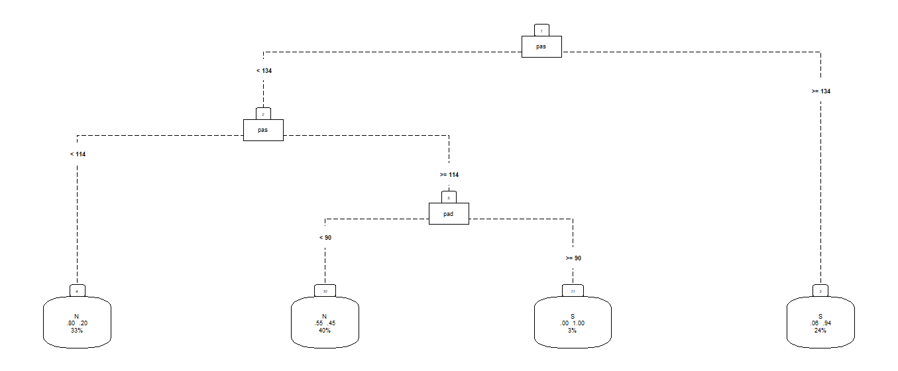
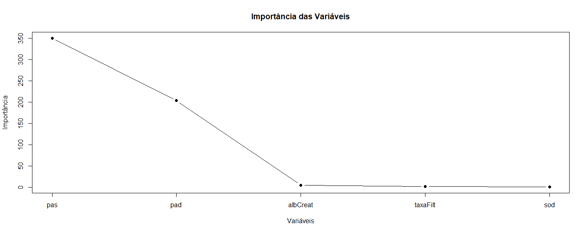
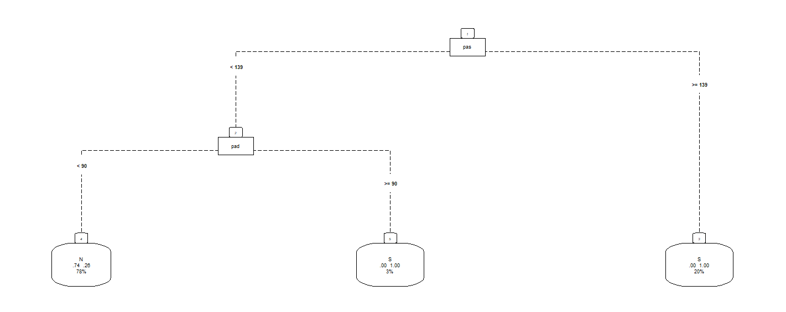
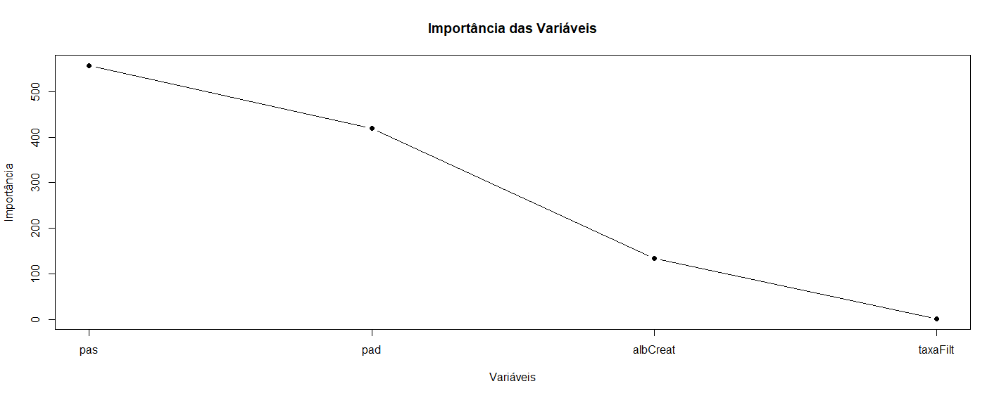
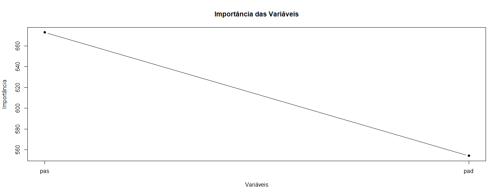
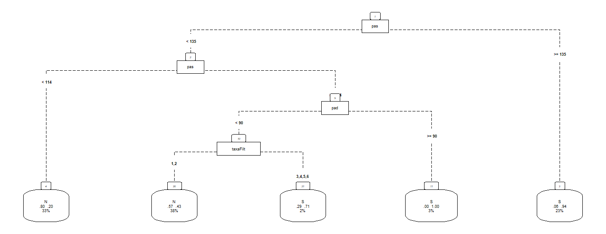
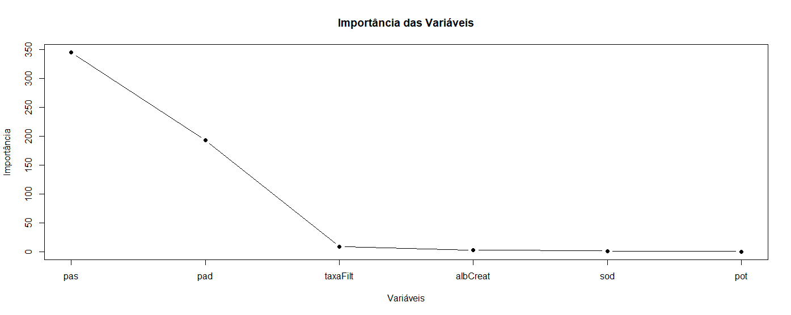
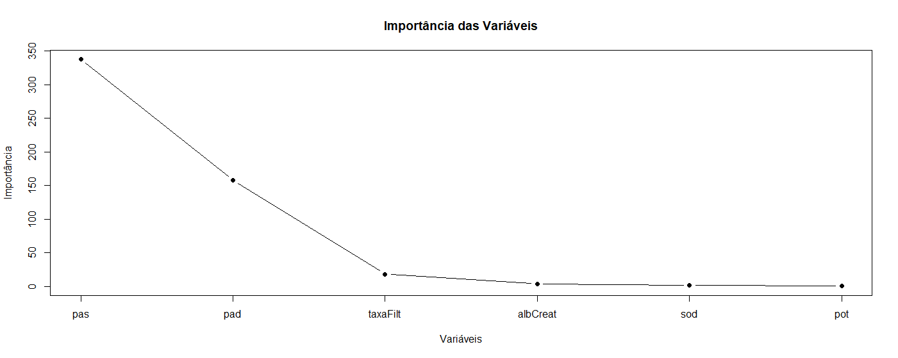
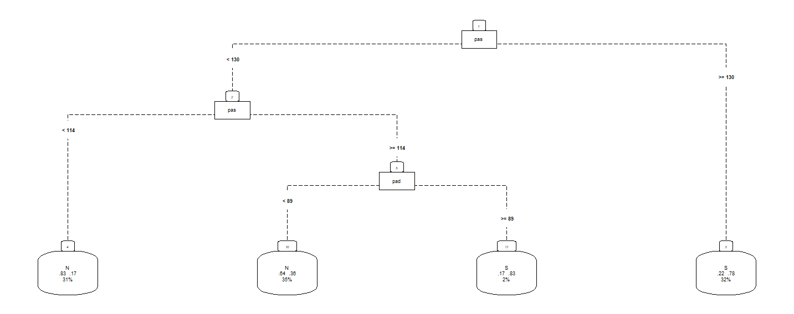
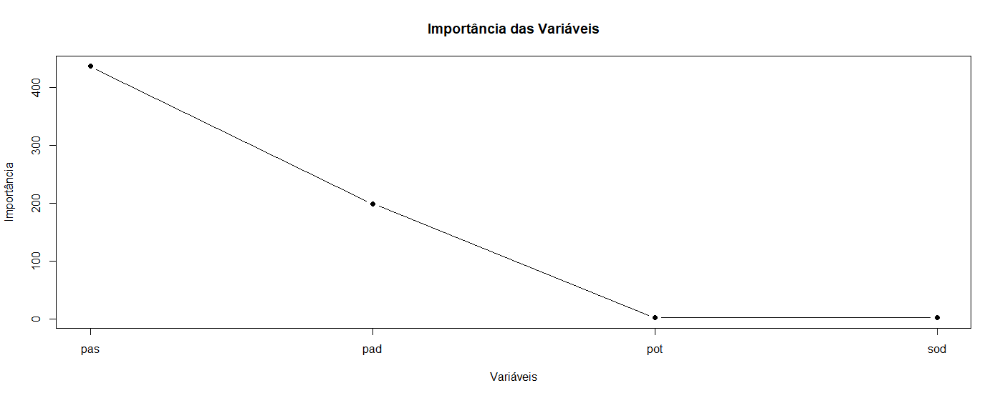

# Summary

- [CART (kNN)](#CART-knn)
- [CART (pmm)](#CART-pmm)
- [kNN](#kNN)
- [pmm](#pmm)

# CART (kNN)

### Wave 1 

#### CART Results

#### Original Class Distribution
| Class | Count |
|-------|-------|
| 0     | 3410  |
| 1     | 1651  |

#### Class Distribution After Undersampling
| Class | Count |
|-------|-------|
| N (0) | 1651  |
| S (1) | 1651  |

#### Summary Statistics of Key Predictors
| Variable    | Description         | Min   | 1st Qu | Median | Mean  | 3rd Qu | Max    |
|-------------|----------------------|-------|--------|--------|-------|--------|--------|
| **pot**     | Potassium intake      | 4.00  | 20.00  | 29.00  | 32.52 | 41.00  | 144.00 |
| **sod**     | Sodium intake         | 9.00  | 69.00  | 101.00 | 109.30| 144.00 | 327.00 |
| **albCreat**| Albumin–Creatinine    | 1.83  | 5.09   | 6.60   | 19.61 | 8.59   | 5014.83|
| **taxaFilt**| GFR class (counts)    | 1 (1959), 2 (2864), 3 (200), 4 (25), 5 (7), 6 (6) | | | | | |
| **pas**     | Systolic BP           | 77.00 | 108.00 | 118.00 | 119.80| 129.00 | 219.50 |
| **pad**     | Diastolic BP          | 44.50 | 67.50  | 74.50  | 75.19 | 82.00  | 131.50 |

#### Variable Importance
|pas    |  pad    |  albCreat | taxaFilt   |  sod   |
|-------|---------|-----------|------------|--------|
|350.26 |  203.48 |     5.01  |     1.60   |  0.78  |

#### Prediction Distribution
| Predicted | True N | True S |
|-----------|--------|--------|
| N         | 477    | 243    |
| S         | 18     | 252    |

- **Accuracy:** 0.7364
- **Precision:** 0.5090909 
- **95% CI:** (0.7077, 0.7636) 
- **Sensitivity** (Recall for S): 0.5091  
- **Specificity:** 0.9636  
- **Balanced Accuracy:** 0.7364

### Wave 2

#### CART Results

#### Original Class Distribution
| Class | Count |
|-------|-------|
| 0     | 2893  |
| 1     | 2168  |

#### Summary Statistics of Key Predictors
| Variable    | Description         | Min    | 1st Qu | Median | Mean   | 3rd Qu | Max      |
|-------------|----------------------|--------|--------|--------|--------|--------|----------|
| **pot**     | Potassium intake      | 1.50   | 22.00  | 29.00  | 33.93  | 43.00  | 167.00   |
| **sod**     | Sodium intake         | 5.00   | 70.00  | 109.00 | 108.10 | 140.00 | 303.00   |
| **albCreat**| Albumin–Creatinine    | 0.000  | 5.630  | 7.395  | 24.353 | 10.380 | 23049.850|
| **taxaFilt**| GFR class (counts)    | 1 (1614), 2 (3163), 3 (234), 4 (37), 5 (7), 6 (6) | | | | | |
| **pas**     | Systolic BP           | 72.50  | 110.00 | 121.50 | 124.90 | 134.50 | 223.50   |
| **pad**     | Diastolic BP          | 44.00  | 69.00  | 76.50  | 77.46  | 85.00  | 122.50   |

#### Variable Importance
|pas    |  pad    |  albCreat | taxaFilt   | 
|-------|---------|-----------|------------|
|557.38 |  419.51 |    34.32  |  134.32    | 

#### Prediction Distribution
| Predicted | True N | True S |
|-----------|--------|--------|
| N         | 862   | 307    |
| S         | 5     | 343    |

- **Accuracy:** 0.7943
- **Precision:** 0.9856322
- **95% CI:** (0.7731, 0.8144)
- **Sensitivity** (Recall for S): 0.5277  
- **Specificity:** 0.9942  
- **Balanced Accuracy:**  0.7610  

### Wave 3

#### CART Results

#### Original Class Distribution
| Class | Count |
|-------|-------|
| 0     | 2276  |
| 1     | 2785  |

#### Summary Statistics of Key Predictors
| Variable    | Description         | Min    | 1st Qu | Median | Mean   | 3rd Qu | Max    |
|-------------|----------------------|--------|--------|--------|--------|--------|--------|
| **pot**     | Potassium intake      | 6.70   | 48.30  | 59.05  | 63.68  | 77.60  | 226.50 |
| **sod**     | Sodium intake         | 10.00  | 86.00  | 125.00 | 116.90 | 140.50 | 292.00 |
| **pas**     | Systolic BP           | 70.00  | 114.00 | 127.00 | 132.20 | 150.00 | 223.00 |
| **pad**     | Diastolic BP          | 48.00  | 71.50  | 79.50  | 79.63  | 91.00  | 133.00 |
 
#### Variable Importance
|pas    |  pad    |
|-------|---------|
|672.95 |  554.11 |

 #### Prediction Distribution
| Predicted | True N | True S |
|-----------|--------|--------|
| N         | 682    | 300    |
| S         | 0      | 535    |

- **Accuracy:** 0.8022
- **Precision:** 1.0000 
- **95% CI:** (0.7813, 0.822) 
- **Sensitivity** (Recall for S): 0.6407 
- **Specificity:** 1.0000   
- **Balanced Accuracy:** 0.8204 

--------------------------------------------------------------------------------------------------------------------------------------------

# CART (pmm)

### Wave 1

#### CART Results 

#### Original Class Distribution
| Class | Count |
|-------|-------|
| 0     | 3411  |
| 1     | 1650  |

#### Distribution After Undersampling
| Class | Count |
|-------|-------|
| 0     | 1650  |
| 1     | 1650  |

#### Summary Statistics of Key Predictors
| Variable    | Description         | Min    | 1st Qu | Median | Mean   | 3rd Qu | Max    |
|-------------|----------------------|--------|--------|--------|--------|--------|--------|
| **pot**     | Potassium intake      | 4.00   | 20.00  | 29.00  | 32.63  | 41.00  | 144.00 |
| **sod**     | Sodium intake         | 9.00   | 68.00  | 102.00 | 109.70 | 145.00 | 327.00 |
| **albCreat**| Albumin–Creatinine    | 1.83   | 5.07   | 6.60   | 19.70  | 8.63   | 5014.83|
| **taxaFilt**| GFR class (frequencies)| 1 (1959), 2 (2864), 3 (200), 4 (25), 5 (7), 6 (6) | - | - | - | - | - |
| **pas**     | Systolic BP           | 77.00  | 108.00 | 118.00 | 119.80 | 129.00 | 219.50 |
| **pad**     | Diastolic BP          | 44.50  | 67.50  | 74.50  | 75.19  | 82.00  | 131.50 |

#### Variable Importance
|pas    |  pad    |  albCreat | taxaFilt   |  sod   | pot   |
|-------|---------|-----------|------------|--------|--------
|344.72 | 192.79  |   2.66    |   8.73     |  1.30  | 0.30  |

#### Evaluation Metrics
- **Accuracy:** 0.7525
- **95% CI:** (0.7244, 0.7791)  
- **Precision (S):** 0.5575758
- **Sensitivity:** 0.5576         
- **Specificity:**  0.9475 

#### Prediction Distribution
| Predicted | True N | True S |
|-----------|--------|--------|
| N         | 469    | 219    |
| S         | 26     | 276    |

### Wave 2

## CART – Wave 2 (MICE-Balanced)

## 1. Original Class Distribution
| Class | Count |
|-------|-------|
| 0     | 3140  |
| 1     | 1921  |

#### Distribution After Undersampling
| Class | Count |
|-------|-------|
| 0     | 1921  |
| 1     | 1921  |

#### Summary Statistics of Key Predictors
| Variable   | Minimum | 1st Quartile | Median  | Mean   | 3rd Quartile | Maximum   |
|------------|---------|--------------|---------|--------|--------------|-----------|
| hip        | 0/1     | —            | —       | —      | —            | —         |
| pot        | 1.50    | 21.00         | 30.00   | 33.47  | 43.00        | 167.00    |
| sod        | 5.0     | 66.0          | 97.0    | 104.8  | 138.0        | 303.0     |
| albCreat   | 0.00    | 5.49          | 7.20    | 25.31  | 9.58         | 23049.85  |
| taxaFilt   | 1 (1740), 2 (3016), 3 (251), 4 (39), 5 (8), 6 (7)  | — | — | — | — | — |
| pas        | 72.5    | 109.5         | 119.5   | 121.2  | 130.5        | 223.5     |
| pad        | 44.0    | 68.5          | 75.5    | 76.0   | 82.5         | 122.5     |

#### Variable Importance
|pas    |  pad    |  albCreat | taxaFilt   |  sod   | pot   |
|-------|---------|-----------|------------|--------|--------
|337.59 | 158.16  |   3.84    |   18.16    |  1.45  |0.15   |

#### Prediction Distribution
| Predicted | True N | True S |
|-----------|--------|--------|
| N         | 539    | 272    |
| S         | 37     | 304    |

- **Accuracy:** 0.7318  
- **95% CI:** (0.7052, 0.7572)
- **Sensitivity** (Recall for S): 0.5278
- **Specificity:** 0.9358   
- **Precision** (for S): 0.6646116 

### Wave 3

#### CART – Wave 3 (MICE‐Balanced)

#### Original Class Distribution
| Class | Count |
|-------|-------|
| 0     | 2813  |
| 1     | 2248  |

#### Summary Statistics of Key Predictors
| Variable    | Description         | Min    | 1st Qu | Median | Mean   | 3rd Qu | Max    |
|-------------|----------------------|--------|--------|--------|--------|--------|--------|
| **pot**     | Potassium intake      | 6.70   | 43.50  | 62.00  | 65.06  | 83.40  | 226.50 |
| **sod**     | Sodium intake         | 10.00  | 77.00  | 113.00 | 114.80 | 150.00 | 292.00 |
| **pas**     | Systolic BP           | 70.00  | 111.00 | 122.00 | 123.40 | 133.50 | 223.00 |
| **pad**     | Diastolic BP          | 48.00  | 69.50  | 76.50  | 76.96  | 83.50  | 133.00 |
  

#### Confusion Matrix & Key Metrics

Prediction Distribution
| Predicted | True N | True S |
|-----------|--------|--------|
| N         | 744    | 299    |
| S         | 99     | 375    |

- **Accuracy:** 0.7376  
- **95% CI:** (0.7147, 0.7596)  
- **Sensitivity** (Recall for S): 0.5564     
- **Specificity:** 0.8826  
- **Precision** (for S): 0.7133   
- **Balanced Accuracy:** 0.7195

### kNN
#### Wave 1

    

<em>Figure 1: CART kNN - wave 1.</em>

  

<em>Figure 2: Importance of variables - wave 1.</em>

#### Wave 2 

    

<em>Figure 3: CART kNN - wave 2.</em>

  

<em>Figure 4: Importance of variables - wave 2.</em>

#### Wave 3 

    

<em>Figure 5: CART kNN - wave 3.</em>

  

<em>Figure 6: Importance of variables - wave 3.</em>

### pmm
#### Wave 1

    

<em>Figure 7: CART pmm - wave 1.</em>

  

<em>Figure 8: Importance of variables - wave 1.</em>

#### Wave 2 

    

<em>Figure 9: CART pmm - wave 2.</em>

  

<em>Figure 10: Importance of variables - wave 2.</em>

#### Wave 3 

    

<em>Figure 11: CART pmm - wave 3.</em>

  

<em>Figure 12: Importance of variables - wave 3.</em>
