## Summary
- [About non-parametric analysis](#About-non--parametric-analysis)
- [Correlation and regression assumption analyses](#Correlation-and-regression-assumption-analyses)
- [Graphical Analysis](#Graphical-analysis)
- [Tutorial for graphical analysis](#Tutorial-for-graphical-analysis)
- [Tutorial for regression analysis](#Tutorial-for-regression-analysis)

## About correlation and regression analysis
Correlation analysis involves assessing the strength and direction of the relationship between two variables. In this project, correlation analysis was used to investigate the relationships between various pollution-related variables and kidney disease indicators. The correlation coefficient provides a measure of the strength and direction of the linear relationship between two variables.

## Correlation and regression assumption analyses

### Potassium x AlbuCreat Ratio (Wave 1)
### Residuals Normality
#### Anderson-Darling Normality Test
- **A:** 1613.7
- **p-value:** < 2.2e-16

### Residuals Outliers
| Min.      | 1st Qu.  | Median  | Mean    | 3rd Qu.  | Max      |
  |-----------|----------|---------|---------|----------|----------|
  | -0.16994  | -0.11539 | -0.09076| 0.00000 | -0.04963 | 33.30390 |
  
  ### Residuals Independence (Durbin-Watson)
  | Lag | Autocorrelation | D-W Statistic | p-value |
  |-----|-----------------|---------------|---------|
  | 1   | 0.007660777     | 1.984674      | 0.188   |
  
  ### Homoscedasticity (Breusch-Pagan)
  
  #### Studentized Breusch-Pagan Test
  - **BP:** 5.0664
- **df:** 1
- **p-value:** 0.02439

### Model Analysis
```r
Call:
  lm(formula = razaoAlbuCreat_interp$onda1 ~ pot_interp$onda1)

Residuals:
  Min     1Q Median     3Q    Max 
-25.5  -17.3  -13.6   -7.4 4988.2 

Coefficients:
  Estimate Std. Error t value Pr(>|t|)    
(Intercept)       31.2964     4.4784   6.988 3.14e-12 ***
  pot_interp$onda1  -0.3579     0.1215  -2.946  0.00323 ** 
  ---
  Signif. codes:  0 ‘***’ 0.001 ‘**’ 0.01 ‘*’ 0.05 ‘.’ 0.1 ‘ ’ 1

Residual standard error: 149.8 on 5059 degrees of freedom
Multiple R-squared:  0.001713, Adjusted R-squared:  0.001516 
F-statistic:  8.68 on 1 and 5059 DF,  p-value: 0.003231
```
###

### Potassium x AlbuCreat Ratio (Wave 2)
### Residuals Normality
#### Anderson-Darling Normality Test
- **A:** 1739.7
- **p-value:** < 2.2e-16

### Residuals Outliers
| Min.      | 1st Qu.  | Median  | Mean    | 3rd Qu.  | Max      |
  |-----------|----------|---------|---------|----------|----------|
  | -0.09086  | -0.06569 | -0.05423| 0.00000 | -0.03610 | 65.75766 |
  
  ### Residuals Independence (Durbin-Watson)
  | Lag | Autocorrelation | D-W Statistic | p-value |
  |-----|-----------------|---------------|---------|
  | 1   | 9.500238e-05    | 1.999808      | 0.47    |
  
  ### Homoscedasticity (Breusch-Pagan)
  
  #### Studentized Breusch-Pagan Test
  - **BP:** 0.36926
- **df:** 1
- **p-value:** 0.5434

### Model Analysis
```r
Call:
  lm(formula = razaoAlbuCreat_interp$onda2 ~ pot_interp$onda2)

Residuals:
  Min      1Q  Median      3Q     Max 
-31.8   -23.0   -19.0   -12.6 23020.5 

Coefficients:
  Estimate Std. Error t value Pr(>|t|)    
(Intercept)       38.9260    10.9663   3.550 0.000389 ***
  pot_interp$onda2  -0.3972     0.2970  -1.338 0.181109    
---
  Signif. codes:  0 ‘***’ 0.001 ‘**’ 0.01 ‘*’ 0.05 ‘.’ 0.1 ‘ ’ 1

Residual standard error: 350.1 on 5059 degrees of freedom
Multiple R-squared:  0.0003535, Adjusted R-squared:  0.0001559 
F-statistic: 1.789 on 1 and 5059 DF,  p-value: 0.1811
```
###

### Potassium x PAS (Wave 1)
### Residuals Normality
#### Anderson-Darling Normality Test
- **A:** 33.045
- **p-value:** < 2.2e-16

### Residuals Outliers
| Min.      | 1st Qu.  | Median  | Mean    | 3rd Qu.  | Max      |
  |-----------|----------|---------|---------|----------|----------|
  | -2.625135 | -0.720605| -0.114896| 0.000003|  0.569285|  5.990038|
  
  ### Residuals Independence (Durbin-Watson)
  | Lag | Autocorrelation | D-W Statistic | p-value |
  |-----|-----------------|---------------|---------|
  | 1   | 0.01925224      | 1.961336      | 0.17    |
  
  ### Homoscedasticity (Breusch-Pagan)
  
  #### Studentized Breusch-Pagan Test
  - **BP:** 12.43
- **df:** 1
- **p-value:** 0.0004225

### Model Analysis
```r
Call:
  lm(formula = PAS_interp$onda1 ~ pot_interp$onda1)

Residuals:
  Min      1Q  Median      3Q     Max 
-43.558 -11.957  -1.906   9.447  99.396 

Coefficients:
  Estimate Std. Error t value Pr(>|t|)    
(Intercept)      121.46543    0.49610 244.841  < 2e-16 ***
  pot_interp$onda1  -0.05043    0.01346  -3.747 0.000181 ***
  ---
  Signif. codes:  0 ‘***’ 0.001 ‘**’ 0.01 ‘*’ 0.05 ‘.’ 0.1 ‘ ’ 1

Residual standard error: 16.6 on 5059 degrees of freedom
Multiple R-squared:  0.002768, Adjusted R-squared:  0.002571 
F-statistic: 14.04 on 1 and 5059 DF,  p-value: 0.0001809
```
###

### Potassium x PAS (Wave 2)
### Residuals Normality
#### Anderson-Darling Normality Test
- **A:** 25.191
- **p-value:** < 2.2e-16

### Residuals Outliers
| Min.      | 1st Qu.  | Median  | Mean    | 3rd Qu.  | Max      |
  |-----------|----------|---------|---------|----------|----------|
  | -2.877353 | -0.717277| -0.088255| -0.000004|  0.570982|  6.164895|
  
  ### Residuals Independence (Durbin-Watson)
  | Lag | Autocorrelation | D-W Statistic | p-value |
  |-----|-----------------|---------------|---------|
  | 1   | 0.02641243      | 1.947118      | 0.078   |
  
  ### Homoscedasticity (Breusch-Pagan)
  
  #### Studentized Breusch-Pagan Test
  - **BP:** 6.6078
- **df:** 1
- **p-value:** 0.01015

### Model Analysis
```r
Call:
  lm(formula = PAS_interp$onda2 ~ pot_interp$onda2)

Residuals:
  Min      1Q  Median      3Q     Max 
-47.812 -11.917  -1.466   9.488 102.455 

Coefficients:
  Estimate Std. Error t value Pr(>|t|)    
(Intercept)      123.4139     0.5206   237.1  < 2e-16 ***
  pot_interp$onda2  -0.0564     0.0141    -4.0 6.42e-05 ***
  ---
  Signif. codes:  0 ‘***’ 0.001 ‘**’ 0.01 ‘*’ 0.05 ‘.’ 0.1 ‘ ’ 1

Residual standard error: 16.62 on 5059 degrees of freedom
Multiple R-squared:  0.003153, Adjusted R-squared:  0.002956 
F-statistic:    16 on 1 and 5059 DF,  p-value: 6.423e-05
```
### 

### Potassium x PAS (Wave 3)
### Residuals Normality
#### Anderson-Darling Normality Test
- **A:** 16.779
- **p-value:** < 2.2e-16

### Residuals Outliers
| Min.      | 1st Qu.  | Median  | Mean    | 3rd Qu.  | Max      |
  |-----------|----------|---------|---------|----------|----------|
  | -1.471348 | -0.708498| -0.073984| -0.000006|  0.579058|  6.236117|
  
  ### Residuals Independence (Durbin-Watson)
  | Lag | Autocorrelation | D-W Statistic | p-value |
  |-----|-----------------|---------------|---------|
  | 1   | 0.005838156     | 1.976948      | 0.130   |
  
  ### Homoscedasticity (Breusch-Pagan)
  
  #### Studentized Breusch-Pagan Test
  - **BP:** 6.1378
- **df:** 1
- **p-value:** 0.01331

### Model Analysis
```r
Call:
  lm(formula = PAS_interp$onda3 ~ pot_interp$onda3)

Residuals:
  Min      1Q  Median      3Q     Max 
-47.490 -11.866  -1.471   9.550 102.051 

Coefficients:
  Estimate Std. Error t value Pr(>|t|)    
(Intercept)      122.8934     0.5225   235.0  < 2e-16 ***
  pot_interp$onda3  -0.0557     0.0142    -3.9  9.7e-05 ***
  ---
  Signif. codes:  0 ‘***’ 0.001 ‘**’ 0.01 ‘*’ 0.05 ‘.’ 0.1 ‘ ’ 1

Residual standard error: 16.61 on 5059 degrees of freedom
Multiple R-squared:  0.002751,   Adjusted R-squared:  0.002553 
F-statistic: 15.19 on 1 and 5059 DF,  p-value: 9.697e-05
```
###

### Potassium x PAD (Wave 1)
### Residuals Normality
#### Anderson-Darling Normality Test
- **A:** 22.491
- **p-value:** < 2.2e-16

### Residuals Outliers
| Min.      | 1st Qu.  | Median  | Mean    | 3rd Qu.  | Max      |
  |-----------|----------|---------|---------|----------|----------|
  | -0.203744 | -0.112863| -0.090872| 0.000003|  0.047186|  9.048541|
  
  ### Residuals Independence (Durbin-Watson)
  | Lag | Autocorrelation | D-W Statistic | p-value |
  |-----|-----------------|---------------|---------|
  | 1   | 0.008839463     | 1.976498      | 0.137   |
  
  ### Homoscedasticity (Breusch-Pagan)
  
  #### Studentized Breusch-Pagan Test
  - **BP:** 5.3925
- **df:** 1
- **p-value:** 0.0202

### Model Analysis
```r
Call:
  lm(formula = PAD_interp$onda1 ~ pot_interp$onda1)

Residuals:
  Min      1Q  Median      3Q     Max 
-27.281  -7.483  -3.195   2.574 177.270 

Coefficients:
  Estimate Std. Error t value Pr(>|t|)    
(Intercept)      82.41257    0.31793  259.21  < 2e-16 ***
  pot_interp$onda1 -0.03858    0.01321   -2.92  0.00351 ** 
  ---
  Signif. codes:  0 ‘***’ 0.001 ‘**’ 0.01 ‘*’ 0.05 ‘.’ 0.1 ‘ ’ 1

Residual standard error: 13.54 on 5059 degrees of freedom
Multiple R-squared:  0.001635,	Adjusted R-squared:  0.001438 
F-statistic: 8.518 on 1 and 5059 DF,  p-value: 0.003507
```
###

### Potassium x PAD (Wave 2)
### Residuals Normality
#### Anderson-Darling Normality Test
- **A:** 22.113
- **p-value:** < 2.2e-16

### Residuals Outliers
| Min.      | 1st Qu.  | Median  | Mean    | 3rd Qu.  | Max      |
  |-----------|----------|---------|---------|----------|----------|
  | -0.194507 | -0.116932| -0.090722| 0.000003|  0.048195|  9.712376|
  
  ### Residuals Independence (Durbin-Watson)
  | Lag | Autocorrelation | D-W Statistic | p-value |
  |-----|-----------------|---------------|---------|
  | 1   | 0.008780494     | 1.976915      | 0.136   |
  
  ### Homoscedasticity (Breusch-Pagan)
  
  #### Studentized Breusch-Pagan Test
  - **BP:** 5.5914
- **df:** 1
- **p-value:** 0.01817

### Model Analysis
```r
Call:
  lm(formula = PAD_interp$onda2 ~ pot_interp$onda2)

Residuals:
  Min      1Q  Median      3Q     Max 
-27.288  -7.463  -3.198   2.572 177.301 

Coefficients:
  Estimate Std. Error t value Pr(>|t|)    
(Intercept)      82.55865    0.31730  260.17  < 2e-16 ***
  pot_interp$onda2 -0.03798    0.01315   -2.89  0.00386 ** 
  ---
  Signif. codes:  0 ‘***’ 0.001 ‘**’ 0.01 ‘*’ 0.05 ‘.’ 0.1 ‘ ’ 1

Residual standard error: 13.54 on 5059 degrees of freedom
Multiple R-squared:  0.001569,	Adjusted R-squared:  0.001371 
F-statistic: 8.337 on 1 and 5059 DF,  p-value: 0.003856
```
###

### Potassium x PAD (Wave 3)
### Residuals Normality
#### Anderson-Darling Normality Test
- **A:** 38.026
- **p-value:** < 2.2e-16

### Residuals Outliers
| Min.      | 1st Qu.  | Median  | Mean    | 3rd Qu.  | Max      |
  |-----------|----------|---------|---------|----------|----------|
  | -0.187186 | -0.116582| -0.090722| 0.000003|  0.047774|  9.650082|
  
  ### Residuals Independence (Durbin-Watson)
  | Lag | Autocorrelation | D-W Statistic | p-value |
  |-----|-----------------|---------------|---------|
  | 1   | 0.008685092     | 1.977644      | 0.142   |
  
  ### Homoscedasticity (Breusch-Pagan)
  
  #### Studentized Breusch-Pagan Test
  - **BP:** 5.6991
- **df:** 1
- **p-value:** 0.01699

### Model Analysis
```r
Call:
  lm(formula = PAD_interp$onda3 ~ pot_interp$onda3)

Residuals:
  Min      1Q  Median      3Q     Max 
-26.771  -7.455  -3.208   2.573 177.298 

Coefficients:
  Estimate Std. Error t value Pr(>|t|)    
(Intercept)      82.57443    0.31696  260.41  < 2e-16 ***
  pot_interp$onda3 -0.03789    0.01315   -2.88  0.00399 ** 
  ---
  Signif. codes:  0 ‘***’ 0.001 ‘**’ 0.01 ‘*’ 0.05 ‘.’ 0.1 ‘ ’ 1

Residual standard error: 13.54 on 5059 degrees of freedom
Multiple R-squared:  0.001569,	Adjusted R-squared:  0.001371 
F-statistic: 8.308 on 1 and 5059 DF,  p-value: 0.003988
```
###

### Sodium x AlbuCreat Ratio (Wave 1)
### Normality of Residuals
#### Anderson-Darling Normality Test
- **A:** 1674.8
- **p-value:** < 2.2e-16

#### Outliers in Residuals
| Min.      | 1st Qu.  | Median  | Mean    | 3rd Qu.  | Max      |
  |-----------|----------|---------|---------|----------|----------|
  | -0.14857  | -0.10353 | -0.08715| 0.00000 | -0.06444 | 33.30298 |
  
  #### Independence of Residuals (Durbin-Watson)
  | Lag | Autocorrelation | D-W Statistic | p-value |
  |-----|-----------------|---------------|---------|
  | 1   | 0.007135967     | 1.985722      | 0.186   |
  
  ### Homoscedasticity (Breusch-Pagan)
  #### Studentized Breusch-Pagan Test
  - **BP:** 1.9673
- **df:** 1
- **p-value:** 0.1607

### Model Analysis
```r
Call:
  lm(formula = razaoAlbuCreat_interp$onda1 ~ sodio_interp$onda1)

Residuals:
  Min     1Q Median     3Q    Max 
-22.3  -15.5  -13.1   -9.7 4990.9 

Coefficients:
  Estimate Std. Error t value Pr(>|t|)    
(Intercept)        26.60356    4.82455   5.514 3.68e-08 ***
  sodio_interp$onda1 -0.06343    0.03960  -1.602    0.109    
---
  Signif. codes:  0 ‘***’ 0.001 ‘**’ 0.01 ‘*’ 0.05 ‘.’ 0.1 ‘ ’ 1

Residual standard error: 149.9 on 5059 degrees of freedom
Multiple R-squared:  0.0005069, Adjusted R-squared:  0.0003093 
F-statistic: 2.566 on 1 and 5059 DF,  p-value: 0.1093
```
###

### Sodium x AlbuCreat Ratio (Wave 2)
### Normality of Residuals
#### Anderson-Darling Normality Test
- **A:** 1756.6
- **p-value:** < 2.2e-16

#### Outliers in Residuals
| Min.      | 1st Qu.  | Median  | Mean    | 3rd Qu.  | Max      |
  |-----------|----------|---------|---------|----------|----------|
  | -0.11162  | -0.06097 | -0.04979| 0.00000 | -0.03926 | 65.75360 |
  
  #### Independence of Residuals (Durbin-Watson)
  | Lag | Autocorrelation | D-W Statistic | p-value |
  |-----|-----------------|---------------|---------|
  | 1   | 4.280738e-05    | 1.999914      | 0.434   |
  
  ### Homoscedasticity (Breusch-Pagan)
  #### Studentized Breusch-Pagan Test
  - **BP:** 0.76561
- **df:** 1
- **p-value:** 0.3816

#### Model Analysis
```r
Call:
  lm(formula = razaoAlbuCreat_interp$onda2 ~ sodio_interp$onda2)

Residuals:
  Min      1Q  Median      3Q     Max 
-39.0   -21.3   -17.4   -13.7 23020.5 

Coefficients:
  Estimate Std. Error t value Pr(>|t|)
(Intercept)        17.17976   11.73220   1.464    0.143
sodio_interp$onda2  0.08332    0.10272   0.811    0.417

Residual standard error: 350.2 on 5059 degrees of freedom
Multiple R-squared:  0.00013, Adjusted R-squared:  -6.76e-05 
F-statistic: 0.658 on 1 and 5059 DF,  p-value: 0.4173
```
###

### Sodium x PAS (wave 1)
### Normality of Residuals
#### Anderson-Darling Normality Test
- **A:** 34.123
- **p-value:** < 2.2e-16

#### Outliers in Residuals
| Min.      | 1st Qu.  | Median  | Mean    | 3rd Qu.  | Max      |
  |-----------|----------|---------|---------|----------|----------|
  | -2.486369 | -0.720625| -0.110385| -0.000006| 0.571935 | 5.919637 |
  
  #### Independence of Residuals (Durbin-Watson)
  | Lag | Autocorrelation | D-W Statistic | p-value |
  |-----|-----------------|---------------|---------|
  | 1   | 0.0217314       | 1.956414      | 0.156   |
  
  ### Homoscedasticity (Breusch-Pagan)
  #### Studentized Breusch-Pagan Test
  - **BP:** 0.087942
- **df:** 1
- **p-value:** 0.7668

#### Model Analysis
```r
Call:
  lm(formula = PAS_interp$onda1 ~ sodio_interp$onda1)

Residuals:
  Min      1Q  Median      3Q     Max 
-41.134 -11.922  -1.826   9.462  97.931 

Coefficients:
  Estimate Std. Error t value Pr(>|t|)    
(Intercept)        1.167e+02  5.326e-01 219.054  < 2e-16 ***
  sodio_interp$onda1 2.887e-02  4.372e-03   6.603 4.44e-11 ***
  ---
  Signif. codes:  0 ‘***’ 0.001 ‘**’ 0.01 ‘*’ 0.05 ‘.’ 0.1 ‘ ’ 1

Residual standard error: 16.55 on 5059 degrees of freedom
Multiple R-squared:  0.008545, Adjusted R-squared:  0.008349 
F-statistic:  43.6 on 1 and 5059 DF,  p-value: 4.44e-11

```
### 

### Sodium x PAS (wave 2)
### Normality of Residuals
#### Anderson-Darling Normality Test
- **A:** 26.483
- **p-value:** < 2.2e-16

#### Outliers in Residuals
| Min.      | 1st Qu.  | Median  | Mean    | 3rd Qu.  | Max      |
  |-----------|----------|---------|---------|----------|----------|
  | -2.896343 | -0.707870| -0.090166| -0.000006| 0.576237 | 6.248253 |
  
  #### Independence of Residuals (Durbin-Watson)
  | Lag | Autocorrelation | D-W Statistic | p-value |
  |-----|-----------------|---------------|---------|
  | 1   | 0.02933663      | 1.999914      | 0.434   |
  
  ### Homoscedasticity (Breusch-Pagan)
  #### Studentized Breusch-Pagan Test
  - **BP:** 0.76561
- **df:** 1
- **p-value:** 0.3816

#### Model Analysis
```r
Call:
  lm(formula = PAS_interp$onda2 ~ sodio_interp$onda2)

Residuals:
  Min      1Q  Median      3Q     Max 
-47.952 -11.718  -1.493   9.541 103.443 

Coefficients:
  Estimate Std. Error t value Pr(>|t|)    
(Intercept)        1.179e+02  5.548e-01 212.392   <2e-16 ***
  sodio_interp$onda2 3.589e-02  4.858e-03   7.389 1.72e-13 ***
  ---
  Signif. codes:  0 ‘***’ 0.001 ‘**’ 0.01 ‘*’ 0.05 ‘.’ 0.1 ‘ ’ 1

Residual standard error: 16.56 on 5059 degrees of freedom
Multiple R-squared:  0.00013, Adjusted R-squared:  -6.76e-05 
F-statistic: 0.658 on 1 and 5059 DF,  p-value: 0.4173
```
###

### Sodium x PAS (wave 3)
### Normality of Residuals
#### Anderson-Darling Normality Test
- **A:** 17.895
- **p-value:** < 2.2e-16

### Outliers in Residuals
| Min.      | 1st Qu.  | Median  | Mean    | 3rd Qu.  | Max      |
  |-----------|----------|---------|---------|----------|----------|
  | -3.108401 | -0.694599| -0.079375| -0.000004| 0.592542 | 5.659293 |
  
  ### Independence of Residuals (Durbin-Watson)
  | Lag | Autocorrelation | D-W Statistic | p-value |
  |-----|-----------------|---------------|---------|
  | 1   | 0.02003576      | 1.959882      | 0.164   |
  
  ### Homoscedasticity (Breusch-Pagan)
  #### Studentized Breusch-Pagan Test
  - **BP:** 1.2706
- **df:** 1
- **p-value:** 0.2597

#### Model Analysis
```r
Call:
  lm(formula = PAS_interp$onda3 ~ sodio_interp$onda3)

Residuals:
  Min      1Q  Median      3Q     Max 
-53.141 -11.875  -1.357  10.129  96.739 

Coefficients:
  Estimate Std. Error t value Pr(>|t|)    
(Intercept)        1.199e+02  6.260e-01 191.544   <2e-16 ***
  sodio_interp$onda3 3.670e-02  5.067e-03   7.242 5.09e-13 ***
  ---
  Signif. codes:  0 ‘***’ 0.001 ‘**’ 0.01 ‘*’ 0.05 ‘.’ 0.1 ‘ ’ 1

Residual standard error: 17.1 on 5059 degrees of freedom
Multiple R-squared:  0.01026, Adjusted R-squared:  0.01007 
F-statistic: 52.45 on 1 and 5059 DF,  p-value: 5.086e-13
```
###

### Sodium x PAD (wave 1)
### Normality of Residuals
#### Anderson-Darling Normality Test
- **A:** 13.687
- **p-value:** < 2.2e-16

#### Outliers in Residuals
| Min.      | 1st Qu.  | Median  | Mean    | 3rd Qu.  | Max      |
  |-----------|----------|---------|---------|----------|----------|
  | -2.843754 | -0.713506| -0.077293| -0.000004| 0.614630 | 5.168393 |
  
  #### Independence of Residuals (Durbin-Watson)
  | Lag | Autocorrelation | D-W Statistic | p-value |
  |-----|-----------------|---------------|---------|
  | 1   | 0.0311765       | 1.937475      | 0.03    |
  
  ### Homoscedasticity (Breusch-Pagan)
  #### Studentized Breusch-Pagan Test
  - **BP:** 9.3953
- **df:** 1
- **p-value:** 0.002175

### Model Analysis
```r
Call:
  lm(formula = PAD_interp$onda1 ~ sodio_interp$onda1)

Residuals:
  Min      1Q  Median      3Q     Max 
-30.424  -7.633  -0.827   6.576  55.295 

Coefficients:
  Estimate Std. Error t value Pr(>|t|)    
(Intercept)        72.39763    0.34437 210.233   <2e-16 ***
  sodio_interp$onda1  0.02552    0.00283   9.029   <2e-16 ***
  ---
  Signif. codes:  0 ‘***’ 0.001 ‘**’ 0.01 ‘*’ 0.05 ‘.’ 0.1 ‘ ’ 1

Residual standard error: 10.7 on 5059 degrees of freedom
Multiple R-squared:  0.01586, Adjusted R-squared:  0.01566 
F-statistic: 81.52 on 1 and 5059 DF,  p-value: < 2.2e-16
```
###

### Sodium x PAD (wave 2)
### Normality of Residuals
#### Anderson-Darling Normality Test
- **A:** 9.5381
- **p-value:** < 2.2e-16

#### Outliers in Residuals
| Min.      | 1st Qu.  | Median  | Mean    | 3rd Qu.  | Max      |
  |-----------|----------|---------|---------|----------|----------|
  | -3.115905 | -0.700198| -0.065465| -0.000006| 0.621874 | 4.589032 |
  
  #### Independence of Residuals (Durbin-Watson)
  | Lag | Autocorrelation | D-W Statistic | p-value |
  |-----|-----------------|---------------|---------|
  | 1   | 0.02600654     | 1.947982      | 0.078   |
  
  ### Homoscedasticity (Breusch-Pagan)
  #### Studentized Breusch-Pagan Test
  - **BP:** 1.7789
- **df:** 1
- **p-value:** 0.1823

### Model Analysis
```r
Call:
  lm(formula = PAD_interp$onda2 ~ sodio_interp$onda2)

Residuals:
  Min      1Q  Median      3Q     Max 
-32.272  -7.251  -0.678   6.440  47.527 

Coefficients:
  Estimate Std. Error t value Pr(>|t|)    
(Intercept)        73.08358   0.347054 210.582   <2e-16 ***
  sodio_interp$onda2  0.02953   0.003039   9.717   <2e-16 ***
  ---
  Signif. codes:  0 ‘***’ 0.001 ‘**’ 0.01 ‘*’ 0.05 ‘.’ 0.1 ‘ ’ 1

Residual standard error: 10.36 on 5059 degrees of freedom
Multiple R-squared:  0.01832, Adjusted R-squared:  0.01813 
F-statistic: 94.41 on 1 and 5059 DF,  p-value: < 2.2e-16
```
###

### Sodium x PAD (wave 3)
### Normality of Residuals
#### Anderson-Darling Normality Test
- **A:** 8.1019
- **p-value:** < 2.2e-16

#### Outliers in Residuals
| Min.      | 1st Qu.  | Median  | Mean    | 3rd Qu.  | Max      |
|-----------|----------|---------|---------|----------|----------|
| -2.650854 | -0.701977| -0.070930| -0.000004| 0.592542 | 5.362959 |
  
#### Independence of Residuals (Durbin-Watson)
| Lag | Autocorrelation | D-W Statistic | p-value |
|-----|-----------------|---------------|---------|
| 1   | 0.02003576     | 1.959882      | 0.164   |
  
  ### Homoscedasticity (Breusch-Pagan)
  #### Studentized Breusch-Pagan Test
  - **BP:** 1.2236
- **df:** 1
- **p-value:** 0.2687

### Model Analysis
```r
Call:
  lm(formula = PAD_interp$onda3 ~ sodio_interp$onda3)

Residuals:
  Min      1Q  Median      3Q     Max 
-27.170  -7.195  -0.727   6.434  54.965 

Coefficients:
  Estimate Std. Error t value Pr(>|t|)    
(Intercept)        74.27951   0.375315 197.913  < 2e-16 ***
  sodio_interp$onda3  0.02471   0.003038   8.133 5.23e-16 ***
  ---
  Signif. codes:  0 ‘***’ 0.001 ‘**’ 0.01 ‘*’ 0.05 ‘.’ 0.1 ‘ ’ 1

Residual standard error: 10.25 on 5059 degrees of freedom
Multiple R-squared:  0.01291, Adjusted R-squared:  0.01271 
F-statistic: 66.14 on 1 and 5059 DF,  p-value: 5.226e-16
```
## Graphical Analysis
### Potassium
#### Analysis of Potassium x Albumin-Creatinine Ratio in Waves 1 and 2 
<div style="display: flex; justify-content: space-around;">
  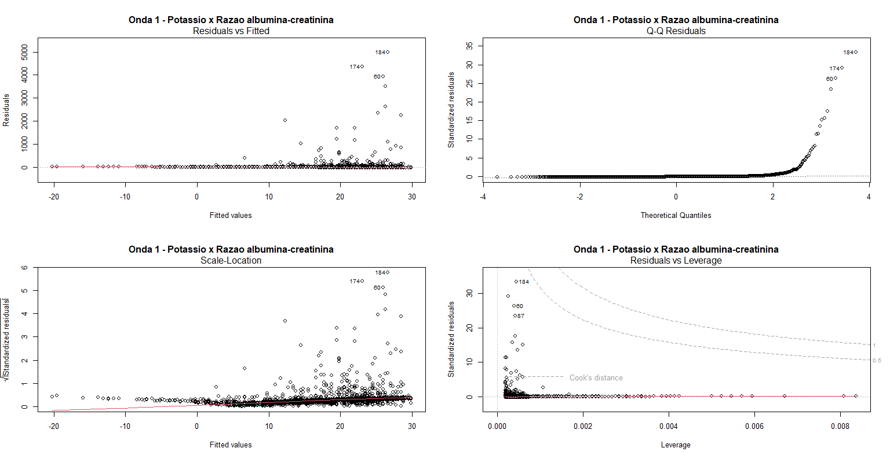
  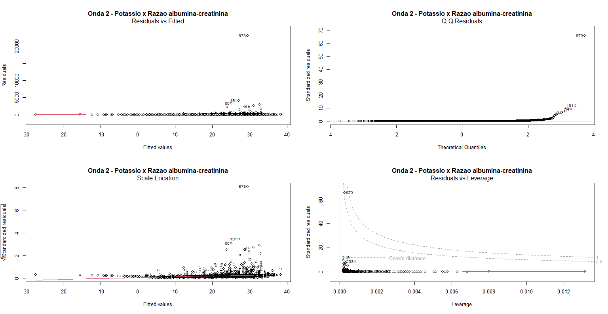
</div>

#### Analysis of Potassium x Systolic blood pressure in Waves 1, 2 and 3 
<div style="display: flex; justify-content: space-around;">
  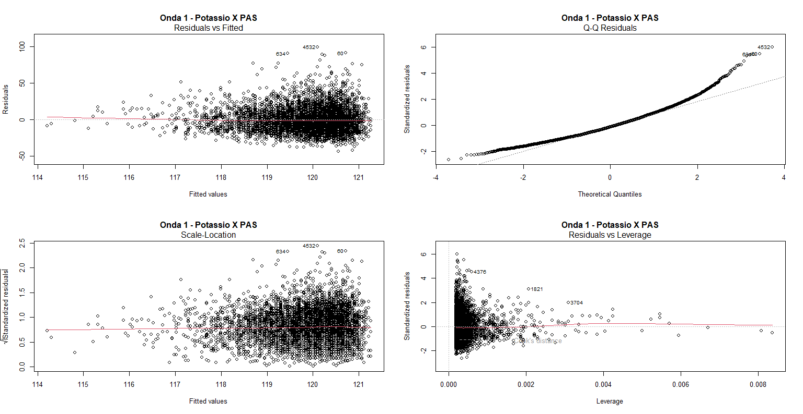
  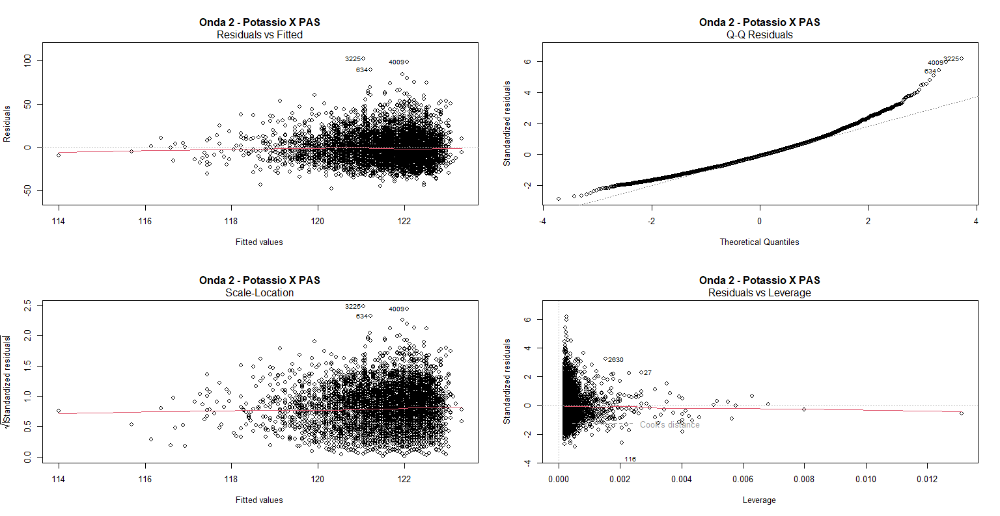
  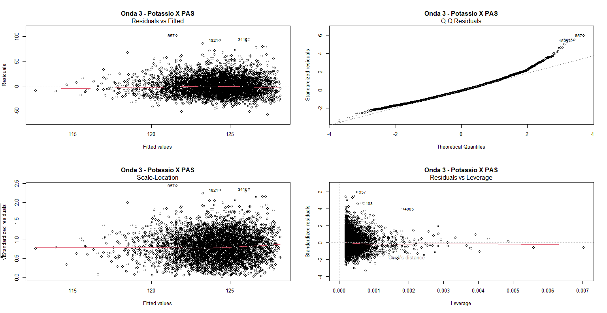
</div>

#### Analysis of Potassium x Diastolic blood pressure in Waves 1, 2 and 3 
<div style="display: flex; justify-content: space-around;">
  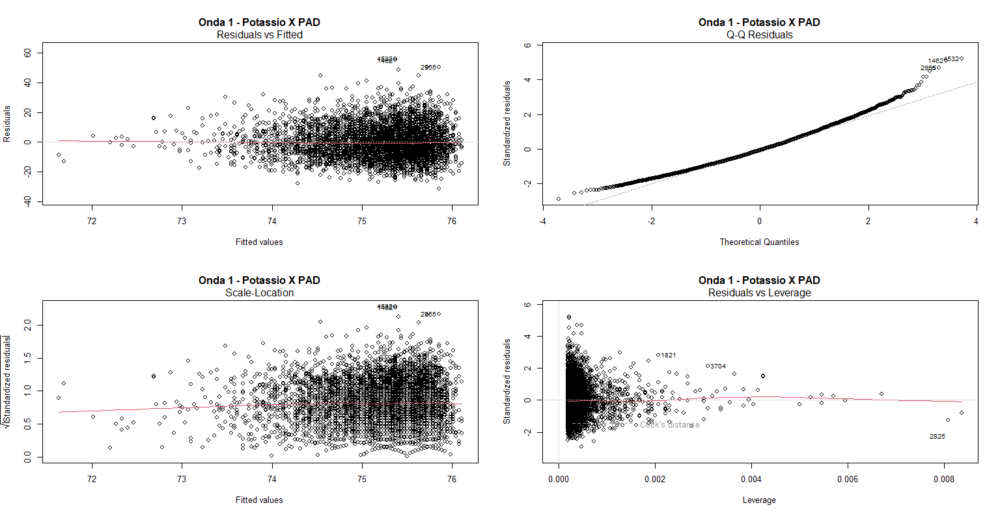
  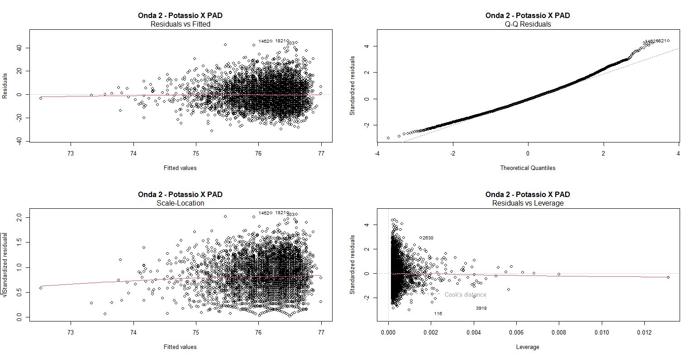
  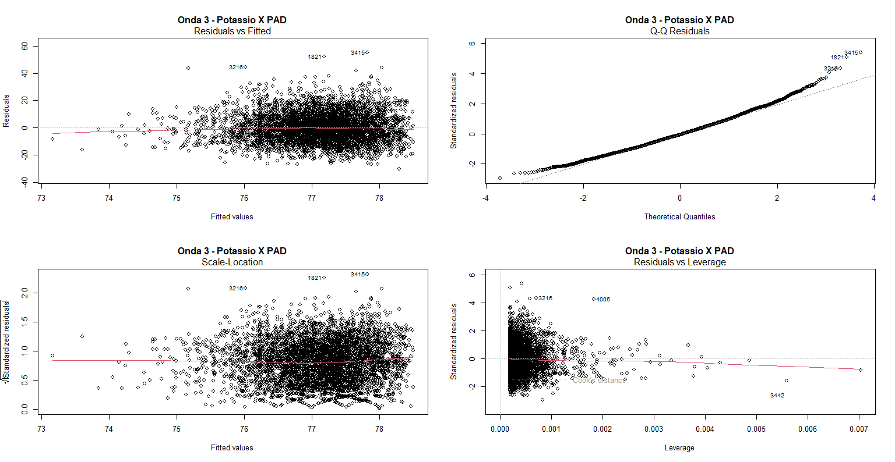
</div>

### Sodium
#### Analysis of Sodium x Albumin-Creatinine Ratio in Waves 1 and 2 
<div style="display: flex; justify-content: space-around;">
  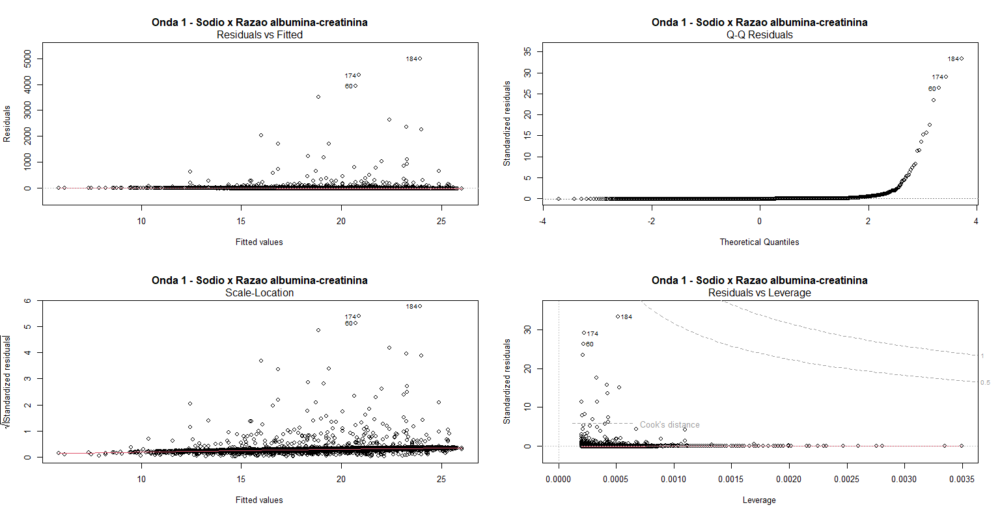
  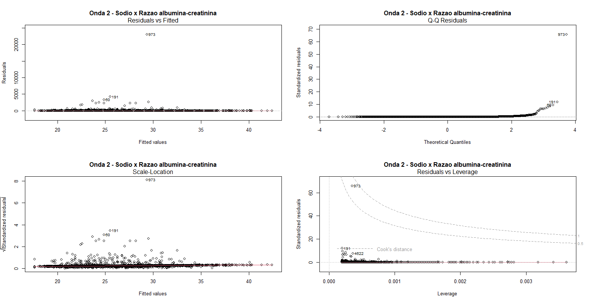
</div>

#### Analysis of Sodium x Systolic blood pressure in Waves 1, 2 and 3 
<div style="display: flex; justify-content: space-around;">
  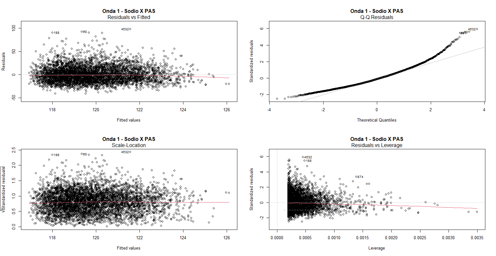
  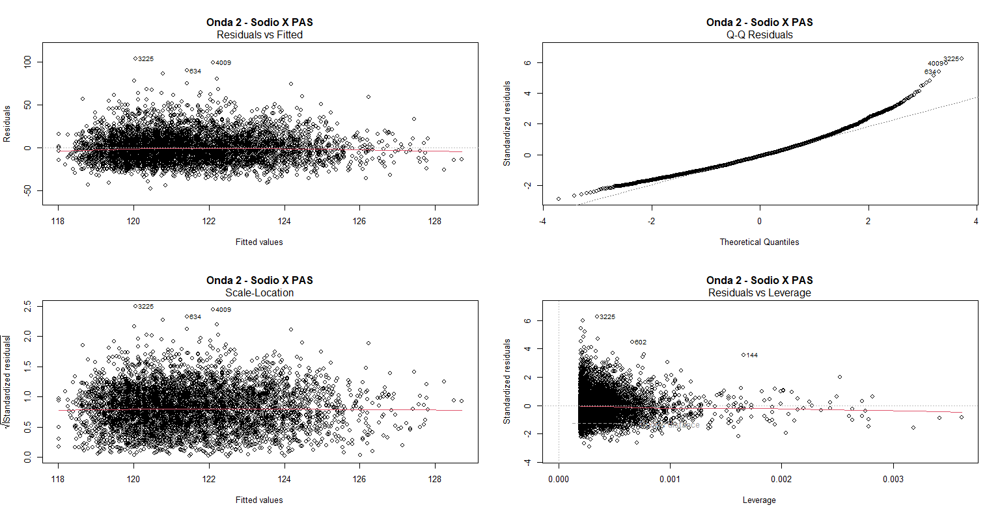
  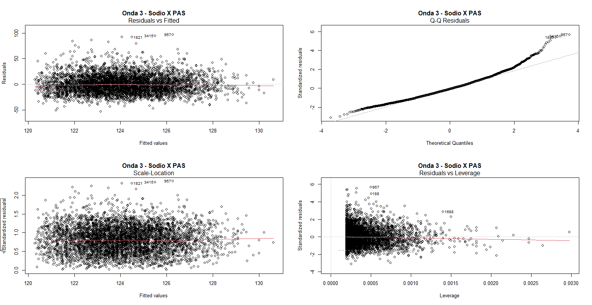
</div>

#### Analysis of Sodium x Diastolic blood pressure in Waves 1, 2 and 3 
<div style="display: flex; justify-content: space-around;">
  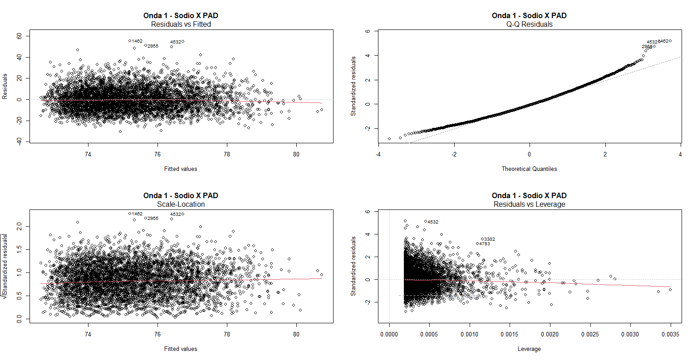
  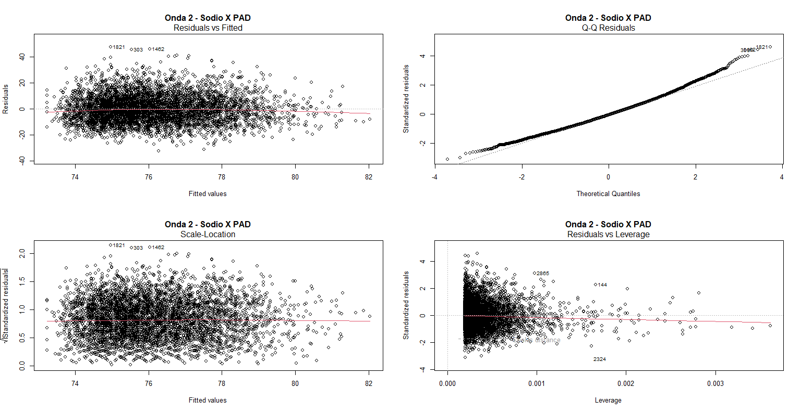
  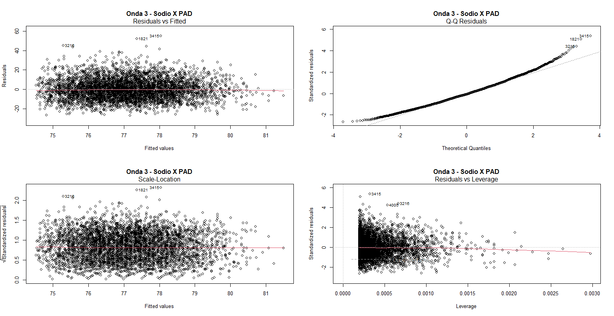
</div>

#### Correlation

- Spearman Correlation: Calculates the correlation based on the rankings of the observations, not the exact values. This means that the presence of outliers does not affect the relative ordering of the observations as much.

- Kendall Correlation: Similar to Spearman, it uses the concordance of ordered pairs and is less impacted by extreme values.

Distance Metric:

- Pearson Correlation: Calculates the correlation based on the Euclidean distance between points, which can be distorted by extreme values.

- Spearman and Kendall: Use order or ranking measures, which are more robust to outliers.

Therefore, when there are outliers in the data, using Spearman or Kendall may be preferable, as these measures tend to provide more stable estimates of the relationship between variables, even in the presence of extreme values.

##### Rho - Spearman correlation between Sodium x (creatinine-albumin ratio, SBP - Systolic Blood Pressure, DBP - Diastolic Blood Pressure)

- wave 1

|   Variable/Correlation           | Spearman   |   Kendall  |
|----------------------------------|------------|------------|
| creatinine-albumin ratio         | -0.1732012 | -0.1174463 | 
| SBP - Systolic Blood Pressure    | 0.1065087  | 0.07111142 | 
| DBP - Diastolic Blood Pressure   | 0.1181976  | 0.07955277 |

- wave 2

|   Variable/Correlation           | Spearman   |   Kendall  |
|----------------------------------|------------|------------|
| creatinine-albumin ratio         | -0.1473922 | -0.09963963 | 
| SBP - Systolic Blood Pressure    | 0.1157807  | 0.0777192   | 
| DBP - Diastolic Blood Pressure   | 0.1280394  | 0.08672395  |

- wave 3

|   Variable/Correlation           | Spearman   |   Kendall  |
|----------------------------------|------------|------------|
| creatinine-albumin ratio         |     -      |      -     | 
| SBP - Systolic Blood Pressure    | 0.1075519  | 0.07242199 | 
| DBP - Diastolic Blood Pressure   | 0.1186492  | 0.08013924 |


## Tutorial for graphical analysis
#### Residuals vs. Fitted Plot
This plot analyzes homoscedasticity and linearity of the model. The red line, when it overlaps the dotted gray line, indicates a well-fitted linear model.
Homoscedasticity (homogeneity of variances): If the points are well-dispersed around the line, forming a "rectangle" or "box," it is a good indication that homoscedasticity is being met. If a triangular shape appears to the left or right, the model exhibits heteroscedasticity.

#### Normal Q-Q Plot
This plot evaluates whether the residuals follow a normal distribution; the values need to lie on the dotted line for the model to be normalized. If points deviate from the curve, it indicates that the model exhibits a non-normal distribution.

#### Scale-Location Plot
This plot is considered the best identifier of homoscedasticity. In this plot, the red line should overlap the dotted line, and the distribution pattern of points should have a "rectangular" appearance.

#### Residuals vs. Leverage Plot
This plot displays the standardized residuals, which can be outliers or leverage points. There is some tolerance for outliers, but leverage points can influence the distribution and, consequently, create a model not suitable for linear regression. Leverage points are identified by values beyond the so-called Cook's line. Outliers above -3 and +3 are considered residual outliers.

## Tutorial for regression analysis
This tutorial will explore the statistical methods used in our analysis. We focus on the following key aspects:

#### Normality of Residuals:
Test the normality of residuals using the Anderson-Darling normality test. The test statistic and p-value are reported.

#### Outliers in Residuals:
Examine outliers in residuals by calculating the minimum, 1st quartile, median, mean, 3rd quartile, and maximum values.

#### Independence of Residuals (Durbin-Watson):
Assess the independence of residuals using the Durbin-Watson statistic. The lag, autocorrelation, D-W statistic, and p-value are provided.

#### Homoscedasticity (Breusch-Pagan):
Homoscedasticity is tested using the studentized Breusch-Pagan test. The Breusch-Pagan statistic, degrees of freedom, and p-value are reported.

#### Model Analysis:
Analyze the model using linear regression. The model formula, residuals, coefficients, standard errors, t-values, and p-values are provided. The significance levels and provide interpretations of the results. By the end of this tutorial, you will have a comprehensive understanding of the statistical methods employed in our analysis.

#### Usage:
```R
##Normality test for residuals
ad.test(data$residuals)      # p =< 0.05 then residue is not normal
                             # p > 0.05 then residue is normal      

##Outliers in the residuals:
summary((rstandard(data))              # Outliers and leverage points                                
                                       # Residuals "max" above value 3, i.e., not between -3 to 3
                                       # With max value above 3, i.e., presence of outlier and leverage point
                                

##Independence of residuals (Durbin-Watson):
durbinWatsonTest(data)                # D-W should be between 1 to 3, hence the value will be consistent 
                                      # H0: p > 0.05: autocorrelation = 0: independence of residuals
                                      # H: p =< 0.05: autocorrelation != 0: no independence of residuals   

## Homoscedasticity (Breusch-Pagan):
bptest(data)                          # p > 0.05: homoscedasticity exists
                                      # p =< 0.05: homoscedasticity does not exist      

#Model analysis
summary(data)                       # p > 0.05: coefficient = 0: independent variable has no impact on dependent variable
                                    # p =< 0.05: coefficient != 0 independent variable has impact on dependent variable
                                    # For every increase/decrease of 1 unit of x (independent variable) the value of the dependent variable increases proportionally to the coefficient   

#F-statistic

                               # R^2 is the best indicator as it relates to simple (linear) regression
                               # R^2 the consumption of the independent variable in percentage explains that of the dependent variable
                               # p =< 0.05 there is a difference between the models
                               # p > 0.05 there is no difference between the models
                               # H0: the value of the mean of the independent variable x occurs independently of the consumption of the dependent variable (without predictor)
                               # H: the value of the dependent variable occurs due to the consumption of the independent variable (with predictor) 
```