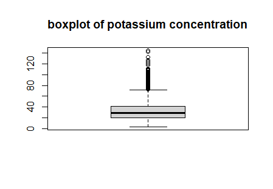
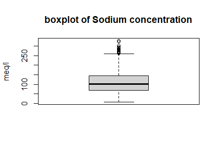

## Statistical Analysis of Sodium (sod) and Potassium (pot) on Hypertension (hip)

### Summary

- [Introduction](#Introduction)
- [Model weighted: Sodium, Potassium, and Their Interaction](#Model-weighted-Sodium-Potassium-and-Their-Interaction)
- [Model 0: Sodium, Potassium and Their Interaction with svyglm](#Model-1-Sodium-Potassium-and-Their-Interaction)
- [Model 1: Sodium, Potassium without Interaction with svyglm](#Model-1-Sodium-Potassium-and-Their-Interaction)
- [Model 2: Sodium, Potassium and Their Interaction](#Model-1-Sodium-Potassium-and-Their-Interaction)
- [Model 3: Sodium and Potassium without Interaction](#Model-2-Sodium-and-Potassium-without-Interaction)
- [Model 4: Sodium Only](#Model-3-Sodium-Only)
- [Model 5: Potassium Only](#Model-4-Potassium-Only)
- [Model Comparison and Residual Analysis](#Model-Comparison-and-Residual-Analysis)
- [Initial conclusion (disregarding the use of the svyglm function)](#Initial-conclusion)
- [Possible pattern issues regarding sodium and potassium](#Possible-pattern-issues-regarding-sodium-and-potassium)

### Introduction

The following analysis involves fitting multiple logistic regression models to examine the relationship between sodium (sod) and potassium (pot) levels, and their interaction, on hypertension (hip). The binary outcome hip is modeled as a function of the predictors, and the goodness-of-fit is evaluated for each model.

### Model weighted: Sodium, Potassium, and Their Interaction

#### Code:
```r
glm(formula = hip ~ sod + pot + sod:pot, family = binomial, data = dadosOnda1, 
    weights = ifelse(dadosOnda1$hip == "S", 3409/1652, 1))
```
#### Output:

|  Coefficients |  Estimate   |  Std. Error  | z value |  Pr(>\|z\|)  |
|---------------|-------------|--------------|---------|--------------|    
| (Intercept)   | 5.753e-01   | 1.181e-01    | 4.870   | 1.11e-06 *** |
| sod           | -6.990e-03  | 1.085e-03    | -6.444  | 1.16e-10 *** |
| pot           | -1.462e-02  | 3.768e-03    | -3.880  | 0.000104 *** |
| sod:pot       | 1.667e-04   | 2.835e-05    | 5.879   | 4.14e-09 *** |

#### Interpretation:

- (Intercept): The intercept coefficient is 0.5753. In logistic regression, this represents the log-odds of the response (hip) when all predictors are zero.
- sod: The coefficient for sod (sodium) is -0.00699, indicating that for each unit increase in sodium, the odds of hypertension decrease. This effect is highly significant (p < 0.001).
- pot: The coefficient for pot (potassium) is -0.01462, meaning that higher potassium levels are also associated with decreased odds of hypertension. This is significant as well.
- sod:pot The interaction term between sodium and potassium has a coefficient of 0.0001667, suggesting that the effect of sodium on hypertension depends on potassium levels, and vice versa. This interaction is also highly significant (p < 0.001).
- P-values indicate that all the estimated coefficients are highly significant. Pr(>\|z\|) values for all coefficients are well below 0.05, meaning that sodium, potassium, and their interaction have a statistically significant impact on hypertension (hip).
- Residual deviance: This is the deviance of the fitted model with the predictors. A reduction from the null deviance suggests that the predictors improve the model fit.
- AIC: The Akaike Information Criterion (AIC) measures model fit while penalizing for the number of parameters. Lower AIC indicates a better model, considering its complexity.

### Model 0: Sodium, Potassium and Their Interaction with svyglm

#### Code:
```r
design <- svydesign(ids = ~1, data = dadosOnda1, 
+                     weights = ifelse(dadosOnda1$hip == "S", 3409/1652, 1))
svyglm(formula = hip ~ sod + pot + sod:pot, design = design, family = binomial())
```

#### Output:

| Coefficients  | Estimate   | Std. Error  | t value  | Pr(>\|t\|)  |
|---------------|------------|-------------|----------|-------------|    
| (Intercept)   | 5.753e-01  | 1.503e-01   |  3.828   | 0.000131 ***|
| sod           | -6.990e-03 | 1.376e-03   | -5.080   | 3.92e-07 ***|
| pot           | -1.462e-02 | 4.786e-03   | -3.055   | 0.002261 ** |
| sod:pot       | 1.667e-04  | 3.624e-05   |  4.600   | 4.33e-06 ***|

#### Interpretation:

- (Intercept): The intercept is 0.5753, and it is statistically significant (p < 0.001). This represents the log-odds of hypertension when both sodium and potassium are at zero.
- sod: The coefficient for sodium is -0.00699, which is statistically significant (p < 0.001). This suggests that as sodium intake increases, the log-odds of having hypertension decrease, implying a negative relationship.
- pot: The coefficient for potassium is -0.01462, also statistically significant (p = 0.002261). This indicates that higher potassium levels are associated with lower log-odds of hypertension, suggesting a negative relationship as well.
- sod:pot The coefficient for the interaction term is 0.0001667, and it is statistically significant (p < 0.001). This positive coefficient suggests that the relationship between sodium and hypertension is influenced by the level of potassium. Specifically, as potassium increases, the negative effect of sodium on hypertension may become less pronounced or even positive.
- Significance of Coefficients: The significance codes indicate that all the coefficients are significant at the 0.001 level (***).
The interaction term being significant means that the impact of sodium on hypertension is dependent on the level of potassium.


### Model 1: Sodium, Potassium without Interaction with svyglm

#### Code:
```r
design <- svydesign(ids = ~1, data = dadosOnda1, 
                    weights = ifelse(dadosOnda1$hip == "S", 3409/1652, 1))
svyglm(formula = hip ~ sod + pot, design = design, family = binomial())
```

#### Output:

| Coefficients  | Estimate   | Std. Error  | t value  | Pr(>\|t\|)  |
|---------------|------------|-------------|----------|-------------|   
| (Intercept)   | -0.0228822 |  0.0748425  | -0.306   | 0.75982     |  
| sod           | -0.0014250 |  0.0006595  | -2.161   | 0.03078 *   | 
| pot           |  0.0055470 |  0.0020989  |  2.643   | 0.00825 **  |

#### Interpretation:

- (Intercept): The intercept is -0.02288, but it is not statistically significant (p = 0.75982).
- sod: The coefficient for sodium is -0.00143, meaning that higher sodium levels are associated with a decrease in the odds of hypertension. This effect is statistically significant (p = 0.03078).
- pot: The coefficient for potassium is 0.00555, indicating that higher potassium levels are associated with an increase in the odds of hypertension. This effect is also statistically significant (p = 0.00825).
- P-values indicate that both sodium and potassium have statistically significant effects on the likelihood of hypertension at a 5% significance level, though the intercept itself is not significant
- The signs of the coefficients tell you: Sodium (sod): Negative relationship with hypertension (as sodium increases, the odds of hypertension decrease). Potassium (pot): Positive relationship with hypertension (as potassium increases, the odds of hypertension increase).


### Model 2: Sodium, Potassium and Their Interaction

#### Code:
```r
glm1 <- glm(data = dadosOnda1, hip ~ sod + pot + sod:pot, family = binomial)
```
#### Output: 

| Coefficients  | Estimate    | Std. Error  | z value |  Pr(>\|z\|)   |
|---------------|-------------|--------------|---------|------------|
| (Intercept)   | 1.310e+00   | 1.500e-01    | 8.738   | <2e-16 *** |
| sod           | -7.143e-03  | 1.370e-03    | -5.216  | 1.83e-07 ***|
| pot           | -1.488e-02  | 4.802e-03    | -3.099  | 0.00194 ** |
| sod:pot       | 1.704e-04   | 3.626e-05    | 4.699   | 2.61e-06 ***|


#### Interpretation:

- Intercept (1.310): The intercept is significant (p < 0.001), indicating the baseline log-odds of hypertension when both sodium and potassium are zero.
- Sodium (sod) (Estimate = -0.007143): A small negative but highly significant effect (p < 0.001), suggesting that increasing sodium reduces the odds of hypertension.
- Potassium (pot) (Estimate = -0.01488): Also significant (p < 0.01), where increasing potassium decreases the odds of hypertension.
- Interaction term (sod:pot) (Estimate = 0.0001704): Highly significant (p < 0.001), suggesting that the relationship between sodium and hypertension depends on the level of potassium.

- P-values: All coefficients (sodium, potassium, and the interaction) are statistically significant (p < 0.05), suggesting that each variable has a significant effect on hypertension when considered with the interaction.
- Model fit: AIC (6368.9) and residual deviance (6360.9): These values ​​indicate the goodness of fit. Compared to the other models, this one has a good fit (smaller AIC indicates better fit).
- Distribution of residuals: The distribution of residuals appears reasonably symmetric, indicating that the model is not violating the assumptions of logistic regression.


### Model 3: Sodium and Potassium without Interaction

#### Code:
```r
glm2 <- glm(data = dadosOnda1, hip ~ sod + pot, family = binomial)
```

#### Output:

|Coefficients   | Estimate    | Std. Error   | z value | Pr(>\|z\|) |   
|---------------|-------------|--------------|---------|------------|
| (Intercept)   | 0.6978450   | 0.0747443    | 9.336   | < 2e-16 ***|
| sod           | -0.0014792  | 0.0006526    |-2.267   | 0.02342 *  | 
| pot           | 0.0058456   | 0.0020583    | 2.840   | 0.00451 ** |

#### Interpretation:

- Intercept (0.6978): Significant (p < 0.001), indicating the baseline log-odds of hypertension.
- Sodium (sod) (Estimate = -0.001479): Significant with a small negative effect (p < 0.05), suggesting that an increase in sodium slightly reduces the odds of hypertension.
- Potassium (pot) (Estimate = 0.0058456): Significant (p < 0.01), where an increase in potassium increases the odds of hypertension, in contrast to the first model, where potassium was protective when considering the interaction.
- Model fit: AIC (6390.1): The fit is reasonable, but the model with the interaction has a smaller AIC (i.e., it is better).

### Model 4: Sodium Only

#### Code:

```r
glm3 <- glm(data = dadosOnda1, hip ~ sod, family = binomial)
```

#### Output:

| Coefficients  | Estimate    | Std. Error   | z value | Pr(>\|z\|) |
|---------------|-------------|--------------|---------|------------|    
| (Intercept)   | 0.7821783   | 0.0687462    | 11.378  | <2e-16 *** | 
| sod           | -0.0005257  | 0.0005619    | -0.936  |  0.349     |

#### Interpretation:

- Intercept (0.7822): The log-odds of a person having hypertension when sodium is zero.
- Sodium (sod) (Estimate = -0.0005257): Not significant (p = 0.349), indicating no strong evidence that sodium alone predicts hypertension in this model.
- Model fit: AIC (6396.3): The highest AIC value indicates that this model has the worst fit among the models analyzed.

### Model 5: Potassium Only

#### Code: 
```r
glm4 <- glm(data = dadosOnda1, hip ~ pot, family = binomial)
```

#### Output:

| Coefficients  |  Estimate   | Std. Error   | z value | Pr(>\|z\|) |
|---------------|-------------|--------------|---------|------------|    
| (Intercept)   | 0.611647    | 0.063982     | 9.560   | <2e-16 *** |
| pot           | 0.003487    | 0.001757     | 1.984   | 0.0473 *   |

#### Interpretation: 

- Intercept (0.6116): The log-odds of a person having hypertension when potassium is zero.
- Potassium (pot) (Estimate = 0.003487): Marginally significant (p = 0.047), suggesting a small but positive effect on hypertension.
- Model fit: AIC (6393.2): The fit is better than the model with sodium, but still inferior to the model including both parameters or the interaction.

### Model Comparison and Residual Analysis
#### Residual Deviance and AIC:

- Model 1 (sod + pot + sod): AIC = 6368.9
- Model 2 (sod + pot): AIC = 6390.1
- Model 3 (sod only): AIC = 6396.3
- Model 4 (pot only): AIC = 6393.2

The model with the interaction term (Model 1) has the lowest AIC, indicating a better fit compared to the other models.

#### Standardized Residuals:
Across all models, the residuals are relatively small, and the mean is close to zero, which indicates that the models are fitting the data reasonably well. However, some influential points with high leverage and Cook’s distance suggest further investigation is needed, especially for the interaction model.

#### Initial conclusion (disregarding the use of the svyglm function)

- The model including the interaction between sodium and potassium provides the best fit, with both sodium and potassium significantly affecting hypertension when their interaction is considered.
- Without the interaction, potassium seems to have a slightly positive effect on hypertension, while sodium alone does not show a significant impact.
- Further residual analysis and investigation into influential points are needed to refine the models.

### Possible pattern issues regarding sodium and potassium

The presence of outliers may have caused the absence of previously known patterns in relation to sodium and potassium, however two possible new scenarios are outlined:

1 - recognition that in the population the outlier values ​​are important enough to ensure that the discordant values ​​are part of the use of some medication, some anomaly or even some clinical condition.

2 - The outliers represent some measurement error or even some numerical anomaly that deserves due treatment.

<div style="display: flex; justify-content: space-around;">
    
</div>

<div style="display: flex; justify-content: space-around;">
    
</div>

<!--### Analysis of the Residuals Vs Leverage Plot

This plot of residuals versus leverage for the hip ~ sod model provides us with some useful information, even though sodium alone did not show statistical significance in ### model. Let's interpret the plot in more detail:

1. Standardized Residuals (Std. Pearson Residuals):
- The vertical axis shows the standardized residuals, which indicate how much the actual observations deviate from the model predictions. In a good fit, we would expect e ### residuals to be randomly distributed around zero.
- Here, the residuals appear to be concentrated around zero, but with some outliers, especially at the top and bottom.

2. Leverage:
- The horizontal axis shows the leverage of each point. Leverage indicates the influence of a particular point on the model fit. A high leverage value suggests that a t ### may have a large impact on the model estimates.
- Most points have low leverage, with a few exceptions near the right side of the plot, where leverage increases. These points should be watched carefully.

3. Cook's Distance:
- The contour lines (dashed and solid) represent Cook's distance, which measures the influence of each point on the overall estimate of the model coefficients.
- In the graph, some points fall outside the Cook's Distance line, suggesting that these points may be influential. These points have high leverage and may be ### roportionately affecting the model fit.

4. General interpretation:
- Although the model did not show significance for the effect of sodium on hypertension, the graph reveals that there are some observations that have high leverage and be ### influencing the model. These observations are potential candidates for further analysis.

- The fact that some points are far from the bulk of the data (outliers and high leverage points) suggests that there may be omitted variables or behavior not adequately captured in the model, or even measurement errors for these observations.

5. Conclusion:
Even if sodium is not relevant in the statistical model, it is important to observe the points with high leverage and outliers. These may be distorting the model fit and should be investigated further.-->