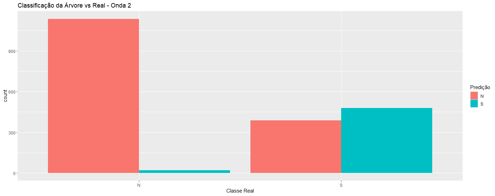

# Summary

- [Inference Tree Analysis Results (kNN)](#inference-tree-analysis-results-knn)
- [Inference Tree Analysis Results (pmm)](#inference-tree-analysis-results-pmm)
- [kNN](#kNN)
- [pmm](#pmm)

# Inference Tree Analysis Results (kNN)

### Wave 1 

#### Original Class Distribution
| Class | Count |
|-------|-------|
| 0     | 3410  |
| 1     | 1651  |

#### Summary Statistics of Key Predictors

| Variable    | Description         | Min   | 1st Qu | Median | Mean  | 3rd Qu | Max    |
|-------------|----------------------|-------|--------|--------|-------|--------|--------|
| **pot**     | Potassium intake      | 4.00  | 20.00  | 29.00  | 32.52 | 41.00  | 144.00 |
| **sod**     | Sodium intake         | 9.00  | 69.00  | 101.00 | 109.30| 144.00 | 327.00 |
| **albCreat**| Albumin–Creatinine    | 1.83  | 5.09   | 6.60   | 19.61 | 8.59   | 5014.83|
| **taxaFilt**| GFR class (counts)    | 1 (1959), 2 (2864), 3 (200), 4 (25), 5 (7), 6 (6) | | | | | |
| **pas**     | Systolic BP           | 77.00 | 108.00 | 118.00 | 119.80| 129.00 | 219.50 |
| **pad**     | Diastolic BP          | 44.50 | 67.50  | 74.50  | 75.19 | 82.00  | 131.50 |

#### Class Distribution After Undersampling
| Class | Count |
|-------|-------|
| N (0) | 1651  |
| S (1) | 1651  |

#### Train/Test Split
- **Train:** 1982 observations × 7 variables  
- **Test:** 1320 observations × 7 variables  

#### Prediction Distribution
| Predicted | True N | True S |
|-----------|--------|--------|
| N         | 633    | 315    |
| S         | 27     | 345    |

- **Accuracy:** 0.7409  
- **Sensitivity** (Recall for S): 0.5227  
- **Specificity:** 0.9591  
- **Precision** (for S): 0.5227273  
- **F1 Score** (for S): 0.6686  
- **Balanced Accuracy:** 0.7409  

### Wave 2

#### Inference Tree Analysis Results

#### Original Class Distribution
| Class | Count |
|-------|-------|
| 0     | 2893  |
| 1     | 2168  |

#### Summary Statistics of Key Predictors
| Variable    | Description         | Min    | 1st Qu | Median | Mean   | 3rd Qu | Max      |
|-------------|----------------------|--------|--------|--------|--------|--------|----------|
| **pot**     | Potassium intake      | 1.50   | 22.00  | 29.00  | 33.93  | 43.00  | 167.00   |
| **sod**     | Sodium intake         | 5.00   | 70.00  | 109.00 | 108.10 | 140.00 | 303.00   |
| **albCreat**| Albumin–Creatinine    | 0.000  | 5.630  | 7.395  | 24.353 | 10.380 | 23049.850|
| **taxaFilt**| GFR class (counts)    | 1 (1614), 2 (3163), 3 (234), 4 (37), 5 (7), 6 (6) | | | | | |
| **pas**     | Systolic BP           | 72.50  | 110.00 | 121.50 | 124.90 | 134.50 | 223.50   |
| **pad**     | Diastolic BP          | 44.00  | 69.00  | 76.50  | 77.46  | 85.00  | 122.50   |
 

#### Class Distribution After Undersampling
| Class | Count |
|-------|-------|
| N (0) | 2168  |
| S (1) | 2168  |

#### Train/Test Split
- **Train:** 3037 observations × 7 variables  
- **Test:** 2024 observations × 7 variables  

#### Prediction Distribution
| Predicted | True N | True S |
|-----------|--------|--------|
| N         | 1157   | 419    |
| S         | 0     | 448    |

- **Accuracy:** 0.7979  
- **Sensitivity** (Recall for S): 0.958  
- **Specificity:** 0.9591  
- **Precision** (for S): 0.5167243  
- **F1 Score** (for S): 0.7008  
- **Balanced Accuracy:** 0.7672  

### Wave 3

#### Original Class Distribution
| Class | Count |
|-------|-------|
| 0     | 2276  |
| 1     | 2785  |

#### Summary Statistics of Key Predictors
| Variable    | Description         | Min    | 1st Qu | Median | Mean   | 3rd Qu | Max    |
|-------------|----------------------|--------|--------|--------|--------|--------|--------|
| **pot**     | Potassium intake      | 6.70   | 48.30  | 59.05  | 63.68  | 77.60  | 226.50 |
| **sod**     | Sodium intake         | 10.00  | 86.00  | 125.00 | 116.90 | 140.50 | 292.00 |
| **pas**     | Systolic BP           | 70.00  | 114.00 | 127.00 | 132.20 | 150.00 | 223.00 |
| **pad**     | Diastolic BP          | 48.00  | 71.50  | 79.50  | 79.63  | 91.00  | 133.00 |
 

#### Train/Test Split
- **Train:** 3037 observations × 5 variables  
- **Test:** 2024 observations × 5 variables  

 #### Prediction Distribution
| Predicted | True N | True S |
|-----------|--------|--------|
| N         | 874    | 375    |
| S         | 36      | 739    |

- **Accuracy:** 0.7969368  
- **95% CI:** (0.7747, 0.8104)  
- **Kappa:** 0.5986  
- **Sensitivity** (Recall for S): 0.6251  
- **Specificity:** 0.9989  
- **Precision** (for S): 0.6633752  
- **Negative Predictive Value:** 0.6848  
- **Balanced Accuracy:** 0.8120
- **Recall (S):** 0.9535484  
- **F1 Score (S):** 0.76889  

--------------------------------------------------------------------------------------------------------------------------------------------

# Inference Tree Analysis Results (pmm)

### Wave 1

#### Inference Tree Analysis Results 

#### Original Class Distribution
| Class | Count |
|-------|-------|
| 0     | 3411  |
| 1     | 1650  |

#### Distribution After Undersampling
| Class | Count |
|-------|-------|
| 0     | 1650  |
| 1     | 1650  |

#### Summary Statistics of Key Predictors
| Variable    | Description         | Min    | 1st Qu | Median | Mean   | 3rd Qu | Max    |
|-------------|----------------------|--------|--------|--------|--------|--------|--------|
| **pot**     | Potassium intake      | 4.00   | 20.00  | 29.00  | 32.63  | 41.00  | 144.00 |
| **sod**     | Sodium intake         | 9.00   | 68.00  | 102.00 | 109.70 | 145.00 | 327.00 |
| **albCreat**| Albumin–Creatinine    | 1.83   | 5.07   | 6.60   | 19.70  | 8.63   | 5014.83|
| **taxaFilt**| GFR class (frequencies)| 1 (1959), 2 (2864), 3 (200), 4 (25), 5 (7), 6 (6) | - | - | - | - | - |
| **pas**     | Systolic BP           | 77.00  | 108.00 | 118.00 | 119.80 | 129.00 | 219.50 |
| **pad**     | Diastolic BP          | 44.50  | 67.50  | 74.50  | 75.19  | 82.00  | 131.50 |

#### Train/Test Split
- **Train:** 2310 observations × 7 variables  
- **Test:** 990 observations × 7 variables  

#### Evaluation Metrics
- **Accuracy:** 0.75556
- **Kappa:** 0.5111
- **95% CI:** (0.7275, 0.782)  
- **Precision (S):** 0.56566
- **Sensitivity:** 0.5657         
- **Specificity:** 0.9455  
- **Recall (S):** 0.91205  
- **F1 Score (S):** 0.69825  

#### Prediction Distribution
| Predicted | True N | True S |
|-----------|--------|--------|
| N         | 468    | 215    |
| S         | 27     | 280    |

### Wave 2

## Inference Tree Analysis Results – Wave 2 (MICE-Balanced)

## 1. Original Class Distribution
| Class | Count |
|-------|-------|
| 0     | 3140  |
| 1     | 1921  |

#### Distribution After Undersampling
| Class | Count |
|-------|-------|
| 0     | 1921  |
| 1     | 1921  |

#### Train/Test Split
- **Train:** 2690 observations × 7 variables  
- **Test:** 1152 observations × 7 variables  

#### Prediction Distribution
| Predicted | True N | True S |
|-----------|--------|--------|
| N         | 443    | 196    |
| S         | 133    | 380    |

- **Accuracy:** 0.7144  
- **95% CI:** (0.6874, 0.7404)  
- **Kappa:** 0.4288  
- **Sensitivity** (Recall for S): 0.6597  
- **Specificity:** 0.7691  
- **Precision** (for S): 0.65972
- **Recall (S):** 0.74074  
- **F1 Score (S):** 0.69789  

### Wave 3

#### Inference Tree Analysis Results – Wave 3 (MICE‐Balanced)

#### Original Class Distribution
| Class | Count |
|-------|-------|
| 0     | 2813  |
| 1     | 2248  |

#### Summary Statistics of Key Predictors
| Variable    | Description         | Min    | 1st Qu | Median | Mean   | 3rd Qu | Max    |
|-------------|----------------------|--------|--------|--------|--------|--------|--------|
| **pot**     | Potassium intake      | 6.70   | 43.50  | 62.00  | 65.06  | 83.40  | 226.50 |
| **sod**     | Sodium intake         | 10.00  | 77.00  | 113.00 | 114.80 | 150.00 | 292.00 |
| **pas**     | Systolic BP           | 70.00  | 111.00 | 122.00 | 123.40 | 133.50 | 223.00 |
| **pad**     | Diastolic BP          | 48.00  | 69.50  | 76.50  | 76.96  | 83.50  | 133.00 |
  

#### Train/Test Split
- **Train:** 3 543 observations × 5 variables  
- **Test:** 1 518 observations × 5 variables  

#### Confusion Matrix & Key Metrics

Prediction Distribution
| Predicted | True N | True S |
|-----------|--------|--------|
| N         | 825    | 387    |
| S         | 18     | 287    |

- **Accuracy:** 0.733  
- **95% CI:** (0.7100, 0.7551)  
- **Kappa:** 0.4279  
- **Sensitivity** (Recall for S): 0.4258  
- **Specificity:** 0.9786  
- **Precision** (for S): 0.42582  
- **Negative Predictive Value:** 0.6807  
- **Balanced Accuracy:** 0.7022
- **Recall (S):** 0.94098  
- **F1 Score (S):** 0.58631  

### kNN
#### Wave 1

    

<em>Figure 1: Árvore inferencial - wave 1.</em>

  

<em>Figure 2: Classificação - wave 1.</em>

#### Wave 2 

    

<em>Figure 3: Árvore inferencial - wave 2.</em>

  

<em>Figure 4: Classificação - wave 2.</em>

#### Wave 3 

    

<em>Figure 5: Árvore inferencial - wave 3.</em>

  

<em>Figure 6: Classificação - wave 3.</em>

### pmm
#### Wave 1

    

<em>Figure 1: Árvore inferencial - wave 1.</em>

  

<em>Figure 2: Classificação - wave 1.</em>

#### Wave 2 

    

<em>Figure 3: Árvore inferencial - wave 2.</em>

  

<em>Figure 4: Classificação - wave 2.</em>

#### Wave 3 

    

<em>Figure 5: Árvore inferencial - wave 3.</em>

  

<em>Figure 6: Classificação - wave 3.</em>
