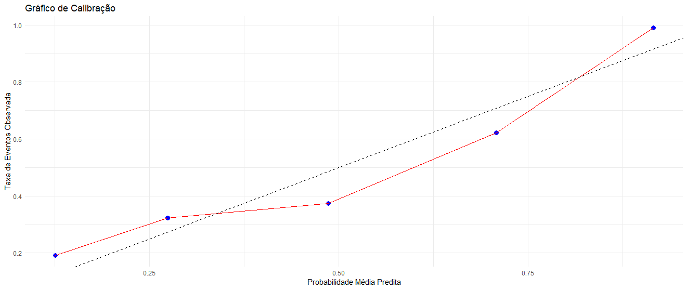
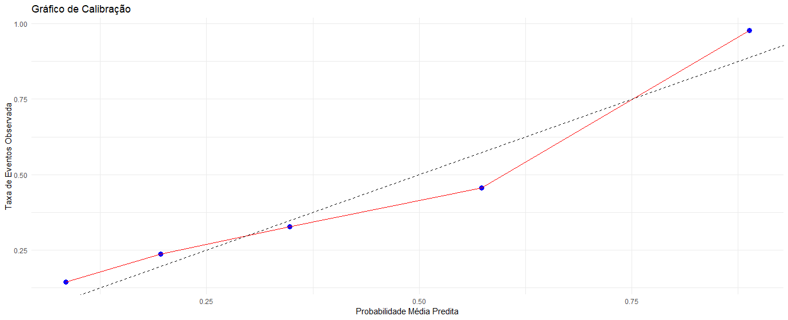
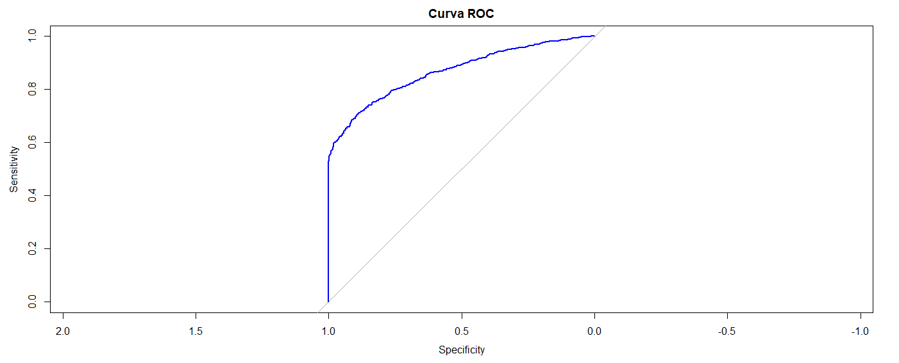
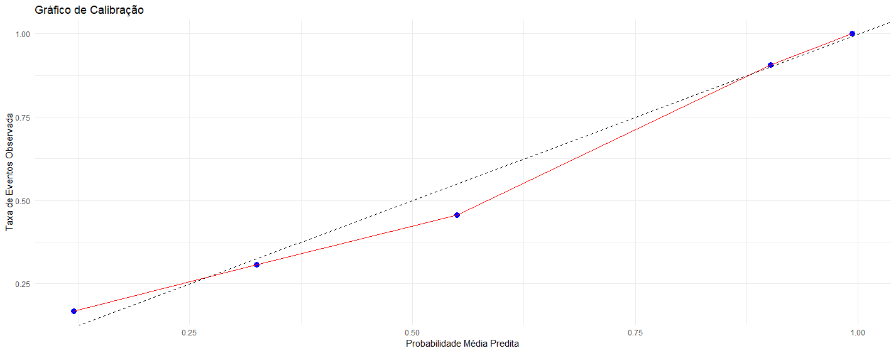
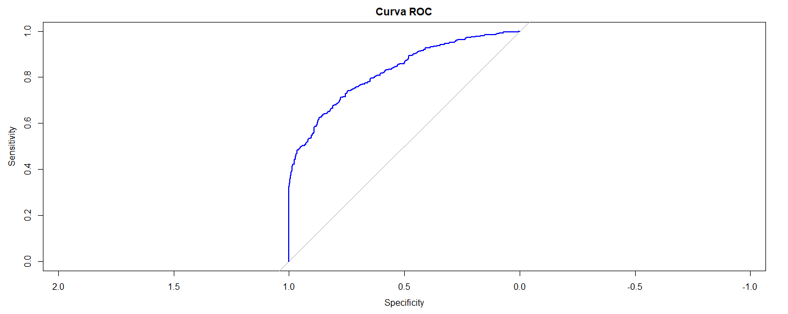
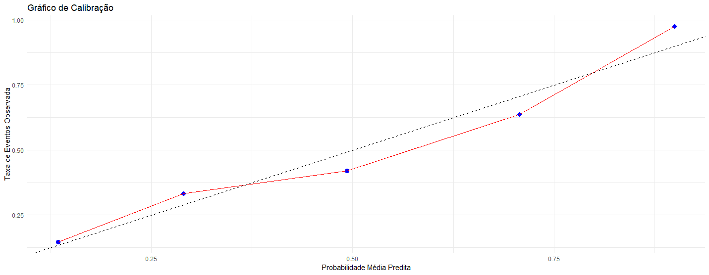
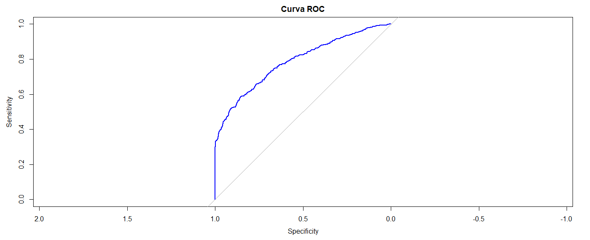
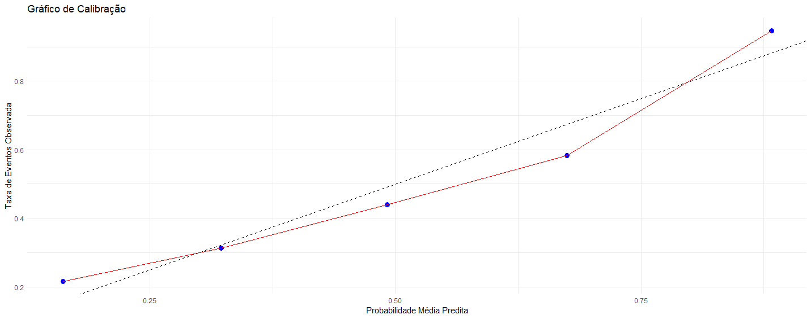
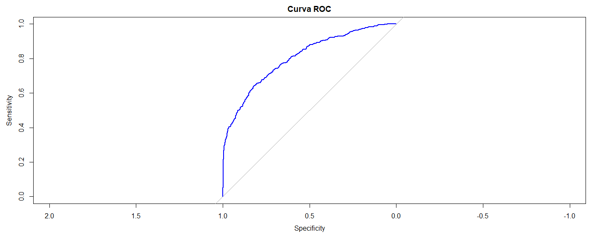
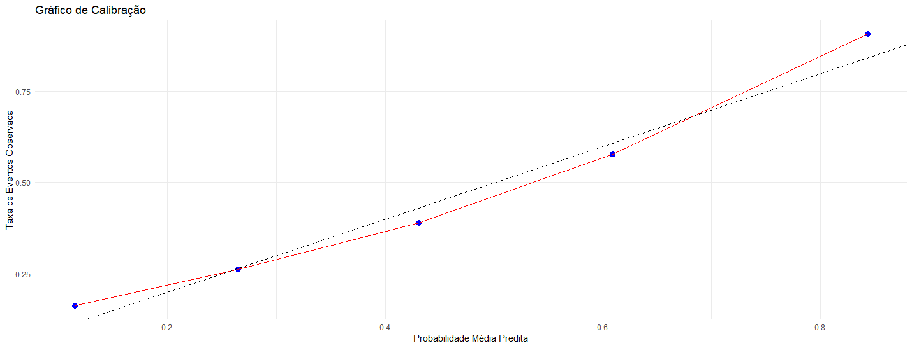

# Summary

- [Logistic regression (kNN)](#Logistic-regression-knn)
- [Logistic regression (pmm)](#Logistic-regression-pmm)
- [kNN](#kNN)
- [pmm](#pmm)

# Logistic regression (kNN)

### Wave 1 

#### Logistic regression Results

#### Original Class Distribution
| Class | Count |
|-------|-------|
| 0     | 3410  |
| 1     | 1651  |

#### Class Distribution After Undersampling
| Class | Count |
|-------|-------|
| N (0) | 1651  |
| S (1) | 1651  |

#### Summary Statistics of Key Predictors
| Variable    | Description         | Min   | 1st Qu | Median | Mean  | 3rd Qu | Max    |
|-------------|----------------------|-------|--------|--------|-------|--------|--------|
| **pot**     | Potassium intake      | 4.00  | 20.00  | 29.00  | 32.52 | 41.00  | 144.00 |
| **sod**     | Sodium intake         | 9.00  | 69.00  | 101.00 | 109.30| 144.00 | 327.00 |
| **albCreat**| Albumin–Creatinine    | 1.83  | 5.09   | 6.60   | 19.61 | 8.59   | 5014.83|
| **taxaFilt**| GFR class (counts)    | 1 (1959), 2 (2864), 3 (200), 4 (25), 5 (7), 6 (6) | | | | | |
| **pas**     | Systolic BP           | 77.00 | 108.00 | 118.00 | 119.80| 129.00 | 219.50 |
| **pad**     | Diastolic BP          | 44.50 | 67.50  | 74.50  | 75.19 | 82.00  | 131.50 |

#### Model

| Variable    | Estimate    | Std. Error | z value | Pr(>\|z\|) | Significance |
|-------------|-------------|------------|---------|----------|--------------|
| (Intercept) | -11.832565  | 0.533486   | -22.180 | < 2e-16  | ***          |
| pot         | 0.006053    | 0.003424   | 1.768   | 0.077088 | .            |
| sod         | -0.003507   | 0.001153   | -3.040  | 0.002364 | **           |
| pas         | 0.080932    | 0.005926   | 13.658  | < 2e-16  | ***          |
| pad         | 0.028060    | 0.008018   | 3.500   | 0.000466 | ***          |
|-------------|-------------|------------|---------|----------|--------------|

#### Prediction Distribution
| Predicted | True N | True S |
|-----------|--------|--------|
| N         | 364    | 139    |
| S         | 131    | 356    |

- **Accuracy:** 0.7273  
- **95% CI:** (0.6984, 0.7548)
- **Sensitivity** (Recall for S): 0.7192 
- **Specificity:** 0.7354   
- **Precision** (for S): 0.7310 
- **AUC:** 0.8142108
- **Balanced Accuracy:** 0.7273

### Wave 2 

#### Logistic regression Results

#### Original Class Distribution
| Class | Count |
|-------|-------|
| 0     | 2893  |
| 1     | 2168  |

#### Summary Statistics of Key Predictors
| Variable    | Description         | Min    | 1st Qu | Median | Mean   | 3rd Qu | Max      |
|-------------|----------------------|--------|--------|--------|--------|--------|----------|
| **pot**     | Potassium intake      | 1.50   | 22.00  | 29.00  | 33.93  | 43.00  | 167.00   |
| **sod**     | Sodium intake         | 5.00   | 70.00  | 109.00 | 108.10 | 140.00 | 303.00   |
| **albCreat**| Albumin–Creatinine    | 0.000  | 5.630  | 7.395  | 24.353 | 10.380 | 23049.850|
| **taxaFilt**| GFR class (counts)    | 1 (1614), 2 (3163), 3 (234), 4 (37), 5 (7), 6 (6) | | | | | |
| **pas**     | Systolic BP           | 72.50  | 110.00 | 121.50 | 124.90 | 134.50 | 223.50   |
| **pad**     | Diastolic BP          | 44.00  | 69.00  | 76.50  | 77.46  | 85.00  | 122.50   |

#### Model
| Variable     | Estimate     | Std. Error  | z value | Pr(>|z|)   | Significance  |
|--------------|--------------|-------------|---------|------------|----------------|
| (Intercept)  | -12.065426   | 0.442508    | -27.266 | < 2e-16    | ***            |
| pot          | 0.006977     | 0.002894    | 2.411   | 0.01590    | *              |
| sod          | -0.001915    | 0.001019    | -1.880  | 0.06017    | .              |
| pas          | 0.082893     | 0.004561    | 18.173  | < 2e-16    | ***            |
| pad          | 0.018041     | 0.006677    | 2.702   | 0.00689    | **             |

#### Prediction Distribution
| Predicted | True N | True S |
|-----------|--------|--------|
| N         | 736    | 243    |
| S         | 131    | 407    |

- **Accuracy:** 0.7535   
- **95% CI:** (0.731, 0.775)
- **Sensitivity** (Recall for S): 0.6262 
- **Specificity:** 0.8489     
- **Precision** (for S): 0.7565 
- **AUC:** 0.8159986
- **Balanced Accuracy:** 0.7375 

### Wave 3 

#### Logistic regression Results

#### Original Class Distribution
| Class | Count |
|-------|-------|
| 0     | 2276  |
| 1     | 2785  |

#### Summary Statistics of Key Predictors
| Variable    | Description         | Min    | 1st Qu | Median | Mean   | 3rd Qu | Max    |
|-------------|----------------------|--------|--------|--------|--------|--------|--------|
| **pot**     | Potassium intake      | 6.70   | 48.30  | 59.05  | 63.68  | 77.60  | 226.50 |
| **sod**     | Sodium intake         | 10.00  | 86.00  | 125.00 | 116.90 | 140.50 | 292.00 |
| **pas**     | Systolic BP           | 70.00  | 114.00 | 127.00 | 132.20 | 150.00 | 223.00 |
| **pad**     | Diastolic BP          | 48.00  | 71.50  | 79.50  | 79.63  | 91.00  | 133.00 |

#### Model
| Variable     | Estimate     | Std. Error  | z value | Pr(>|z|)   | Significance  |
|--------------|--------------|-------------|---------|------------|----------------|
| (Intercept)  | -11.400000   | 0.454300    | -25.082 | < 2e-16    | ***            |
| pot          | -0.001593    | 0.001610    | -0.989  | 0.322460   |                |
| sod          | -0.003476    | 0.000946    | -3.674  | 0.000239   | ***            |
| pas          | 0.090080     | 0.004253    | 21.179  | < 2e-16    | ***            |
| pad          | 0.007649     | 0.006496    | 1.178   | 0.238990   |                |

#### Prediction Distribution
| Predicted | True N | True S |
|-----------|--------|--------|
| N         | 522    | 171    |
| S         | 160    | 664    |

- **Accuracy:** 0.7818   
- **95% CI:** (0.7602, 0.8024)
- **Sensitivity** (Recall for S): 0.7952 
- **Specificity:** 0.7654      
- **Precision** (for S): 0.8058 
- **AUC:** 0.8672994
- **Balanced Accuracy:** 0.7803

------------------------------------------------------------------------------------------------------------------------------------------------------

# Logistic regression (pmm)

### Wave 1 

#### Logistic regression Results

#### Original Class Distribution
| Class | Count |
|-------|-------|
| 0     | 3411  |
| 1     | 1650  |

#### Class Distribution After Undersampling
| Class | Count |
|-------|-------|
| N (0) | 1652  |
| S (1) | 1650  |

#### Summary Statistics of Key Predictors
| Variable    | Description         | Min   | 1st Qu | Median | Mean  | 3rd Qu | Max    |
|-------------|----------------------|-------|--------|--------|-------|--------|--------|
| **pot**     | Potassium intake      | 4.00  | 20.00  | 29.00  | 32.52 | 41.00  | 144.00 |
| **sod**     | Sodium intake         | 9.00  | 69.00  | 101.00 | 109.30| 144.00 | 327.00 |
| **albCreat**| Albumin–Creatinine    | 1.83  | 5.09   | 6.60   | 19.61 | 8.59   | 5014.83|
| **taxaFilt**| GFR class (counts)    | 1 (1959), 2 (2864), 3 (200), 4 (25), 5 (7), 6 (6) | | | | | |
| **pas**     | Systolic BP           | 77.00 | 108.00 | 118.00 | 119.80| 129.00 | 219.50 |
| **pad**     | Diastolic BP          | 44.50 | 67.50  | 74.50  | 75.19 | 82.00  | 131.50 |

#### Model
| Variable     | Estimate     | Std. Error  | z value | Pr(>|z|)   | Significance  |
|--------------|--------------|-------------|---------|------------|----------------|
| (Intercept)  | -11.256782   | 0.517962    | -21.733 | < 2e-16    | ***            |
| pot          | 0.004244     | 0.003227    | 1.315   | 0.188439   |                |
| sod          | -0.003021    | 0.001103    | -2.739  | 0.006162   | **             |
| pas          | 0.077117     | 0.005882    | 13.111  | < 2e-16    | ***            |
| pad          | 0.026534     | 0.008006    | 3.314   | 0.000919   | ***            |

#### Prediction Distribution
| Predicted | True N | True S |
|-----------|--------|--------|
| N         | 368    | 129    |
| S         | 125    | 368    |

- **Accuracy:** 0.7434   
- **95% CI:** (0.715, 0.7704)
- **Sensitivity** (Recall for S): 0.7404 
- **Specificity:** 0.7465    
- **Precision** (for S): 0.7465  
- **AUC:** AUC: 0.8245497
- **Balanced Accuracy:** 0.7434

### Wave 2 

#### Logistic regression Results

#### Original Class Distribution
| Class | Count |
|-------|-------|
| 0     | 3140  |
| 1     | 1921  |

#### Class Distribution After Undersampling
| Class | Count |
|-------|-------|
| N (0) | 1921  |
| S (1) | 1921  |

#### Summary Statistics of Key Predictors
| Variable    | Description         | Min    | 1st Qu | Median | Mean   | 3rd Qu | Max      |
|-------------|----------------------|--------|--------|--------|--------|--------|----------|
| **pot**     | Potassium intake      | 1.50   | 22.00  | 29.00  | 33.93  | 43.00  | 167.00   |
| **sod**     | Sodium intake         | 5.00   | 70.00  | 109.00 | 108.10 | 140.00 | 303.00   |
| **albCreat**| Albumin–Creatinine    | 0.000  | 5.630  | 7.395  | 24.353 | 10.380 | 23049.850|
| **taxaFilt**| GFR class (counts)    | 1 (1614), 2 (3163), 3 (234), 4 (37), 5 (7), 6 (6) | | | | | |
| **pas**     | Systolic BP           | 72.50  | 110.00 | 121.50 | 124.90 | 134.50 | 223.50   |
| **pad**     | Diastolic BP          | 44.00  | 69.00  | 76.50  | 77.46  | 85.00  | 122.50   |

#### Model
| Variable     | Estimate     | Std. Error  | z value | Pr(>|z|)   | Significance  |
|--------------|--------------|-------------|---------|------------|----------------|
| (Intercept)  | -10.461175   | 0.468319    | -22.338 | < 2e-16    | ***            |
| pot          | 0.006234     | 0.002972    | 2.097   | 0.0360     | *              |
| sod          | -0.001871    | 0.001055    | -1.773  | 0.0762     | .              |
| pas          | 0.080157     | 0.005033    | 15.926  | < 2e-16    | ***            |
| pad          | 0.008409     | 0.006927    | 1.214   | 0.2248     |                |

#### Prediction Distribution
| Predicted | True N | True S |
|-----------|--------|--------|
| N         | 413    | 178    |
| S         | 163    | 398    |

- **Accuracy:** 0.704   
- **95% CI:** (0.6767, 0.7302)
- **Sensitivity** (Recall for S):0.6910 
- **Specificity:** 0.7170    
- **Precision** (for S): 0.7094 
- **AUC:** 0.7872058
- **Balanced Accuracy:** 0.7040 

### Wave 3 

#### Logistic regression Results

#### Original Class Distribution
| Class | Count |
|-------|-------|
| 0     | 2813  |
| 1     | 2248  |

#### Summary Statistics of Key Predictors
| Variable    | Description         | Min    | 1st Qu | Median | Mean   | 3rd Qu | Max    |
|-------------|----------------------|--------|--------|--------|--------|--------|--------|
| **pot**     | Potassium intake      | 6.70   | 48.30  | 59.05  | 63.68  | 77.60  | 226.50 |
| **sod**     | Sodium intake         | 10.00  | 86.00  | 125.00 | 116.90 | 140.50 | 292.00 |
| **pas**     | Systolic BP           | 70.00  | 114.00 | 127.00 | 132.20 | 150.00 | 223.00 |
| **pad**     | Diastolic BP          | 48.00  | 71.50  | 79.50  | 79.63  | 91.00  | 133.00 |

#### Model
| Variable     | Estimate     | Std. Error  | z value | Pr(>|z|)   | Significance  |
|--------------|--------------|-------------|---------|------------|----------------|
| (Intercept)  | -10.640000   | 0.429400    | -24.778 | < 2e-16    | ***            |
| pot          | -0.002626    | 0.001418    | -1.853  | 0.06395    | .              |
| sod          | -0.002263    | 0.000832    | -2.720  | 0.00652    | **             |
| pas          | 0.081210     | 0.004158    | 19.529  | < 2e-16    | ***            |
| pad          | 0.010320     | 0.005695    | 1.813   | 0.06984    | .              |

#### Prediction Distribution
| Predicted | True N | True S |
|-----------|--------|--------|
| N         | 652    | 239    |
| S         | 169    | 458    |

- **Accuracy:** 0.7312   
- **95% CI:** (0.7082, 0.7534)
- **Sensitivity** (Recall for S): 0.6571  
- **Specificity:** 0.7942     
- **Precision** (for S): 0.7305  
- **AUC:** 0.8053918
- **Balanced Accuracy:** 0.7256 

### kNN
#### Wave 1

    

<em>Figure 1: ROC kNN - wave 1.</em>

  

<em>Figure 2: Probability - wave 1.</em>

#### Wave 2 

    

<em>Figure 3: ROC kNN - wave 2.</em>

  

<em>Figure 4: Probability kNN - wave 2.</em>

#### Wave 3 

    

<em>Figure 5: ROC kNN - wave 3.</em>

  

<em>Figure 6: Probability kNN - wave 3.</em>

### pmm
#### Wave 1

    

<em>Figure 7: ROC pmm - wave 1.</em>

  

<em>Figure 8: Probability pmm - wave 1.</em>

#### Wave 2 

    

<em>Figure 9: ROC pmm - wave 2.</em>

  

<em>Figure 10: Probability pmm - wave 2.</em>

#### Wave 3 

    

<em>Figure 11: ROC pmm - wave 3.</em>

  

<em>Figure 12: Probability pmm - wave 3.</em>
