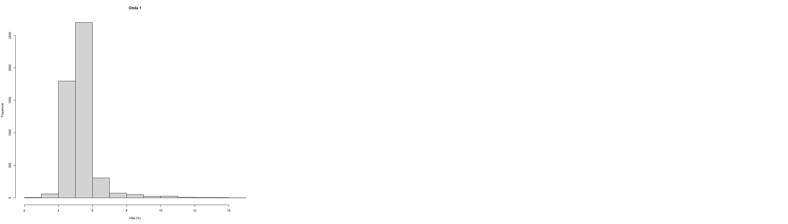
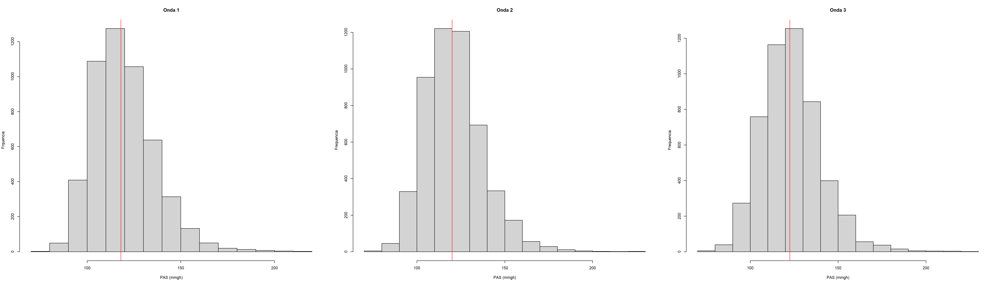
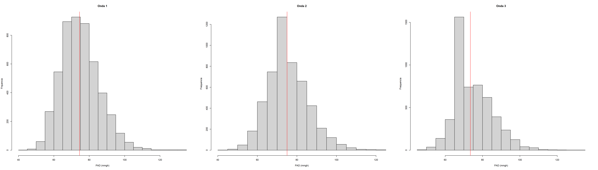
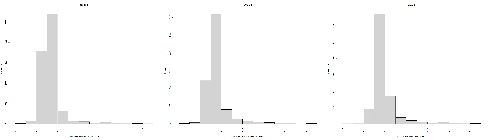
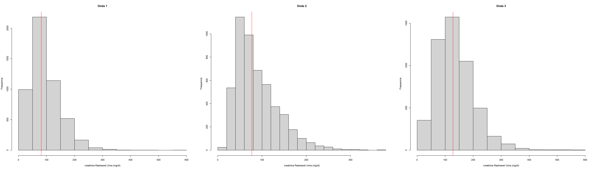
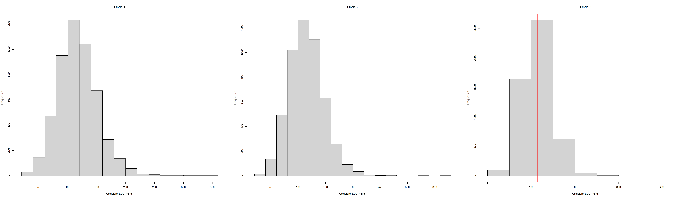
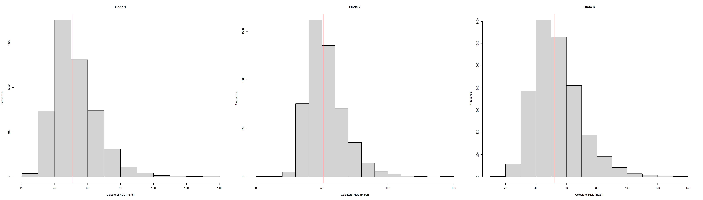

## Summary
- [About non-parametric analysis](#About-non--parametric-analysis)
- [non-Parametric analysis - Friedman test](#non-parametric-analysis---friedman-test)
- [non-Parametric analysis - Wilcoxon test](#non-parametric-analysis---wilcoxon-test)

## About non-parametric analysis
Statistical analysis was performed using the non-parametric Friedman and Wilcoxon tests. These tests were chosen due to the lack of normal distribution in the data. Non-parametric tests are suitable for ordinal or non-normally distributed interval data. The Friedman test is used for comparing more than two groups, while the Wilcoxon test is used for paired samples to assess differences in their median values.

In the descriptive analyses, parts 1 and 2, only non-null values were considered, as they were indexed to ages in waves 1, 2, and 3, in order to show, significantly, the patients in their progressions, either in some medical characteristic or in the use of some medication.

In the analysis of non-parametric methods, the analyses were considered in groups (Friedman method) or pairs (Wilcoxon) of waves with the medical variables and their consequent differences between the waves, that is, the medians. It is worth noting that normality was not found, neither in the separate waves nor in the three waves together.

## non-Parametric analysis - Friedman test

### Statistical Analysis of Glycated Hemoglobin (`Hba`) Data
#### Anderson-Darling Normality Test

| Wave  | Statistic | p-value       |
|-------|-----------|---------------|
| wave1 | 287.79    | < 2.2e-16     |
| wave2 | 388.14    | < 2.2e-16     |
| wave3 | 394.98    | < 2.2e-16     |

- **Result:** All p-values are less than 2.2e-16, indicating that the data does not follow a normal distribution in each wave.

#### Friedman Test
- **Test Statistic:** 3264.5
- **Degrees of Freedom:** 2
- **p-value:** < 2.2e-16

**Result:** The p-value is less than 2.2e-16, indicating significant differences in the medians of `Hba` between the different waves.

#### Multiple Comparison (Post-hoc) Test
| Comparison    | Statistic | p-value       | Adjusted p-value | Significance |
|---------------|-----------|---------------|------------------|--------------|
| wave1 vs. wave2 | 3029634 | 1.68e-136 | 5.04e-136 | ****         |
| wave1 vs. wave3 | 1123136 | 0         | 0         | ****         |
| wave2 vs. wave3 | 2053442 | 8.29e-298 | 2.49e-297 | ****         |

**Result:** All p-values are less than 0.05, indicating significant differences between the medians of `Hba` in all wave combinations.

#### Descriptive Analysis
| Wave  | N    | Median | IQR |
|-------|------|--------|-----|
| wave1 | 5061 | 5.2    | 0.7 |
| wave2 | 5061 | 5.4    | 0.6 |
| wave3 | 5061 | 5.6    | 0.7 |

**Result:** The medians of `Hba` increase slightly from one wave to another, suggesting a trend of increasing levels of glycated hemoglobin over the waves.

  

### Statistical Analysis of Systolic Blood Pressure (`PAS`) Data
#### Anderson-Darling Normality Test
| Wave  | Statistic | p-value       |
|-------|-----------|---------------|
| wave1 | 34.127    | < 2.2e-16     |
| wave2 | 24.385    | < 2.2e-16     |
| wave3 | 18.733    | < 2.2e-16     |

**Result:** All p-values are less than 2.2e-16, indicating that the data does not follow a normal distribution in each wave.

#### Friedman Test
- **Test Statistic:** 385.02
- **Degrees of Freedom:** 2
- **p-value:** < 2.2e-16

**Result:** The p-value is less than 2.2e-16, indicating significant differences in the medians of `PAS` between the different waves.

#### Multiple Comparison (Post-hoc) Test
| Comparison    | Statistic | p-value       | Adjusted p-value | Significance |
|---------------|-----------|---------------|------------------|--------------|
| wave1 vs. wave2 | 5078835 | 3.81e-28 | 1.14e-27 | ****         |
| wave1 vs. wave3 | 4225134 | 3.33e-87 | 9.99e-87 | ****         |
| wave2 vs. wave3 | 4918469 | 4.47e-36 | 1.34e-35 | ****         |

**Result:** All p-values are less than 0.05, indicating significant differences between the medians of `PAS` in all wave combinations.

#### Descriptive Analysis
| Wave  | N    | Median | IQR |
|-------|------|--------|-----|
| wave1 | 5061 | 118    | 21  |
| wave2 | 5061 | 120    | 21.5|
| wave3 | 5061 | 122    | 21  |

- **Result:** The medians of `PAS` increase slightly from one wave to another, suggesting a trend of increasing systolic blood pressure over the waves.

  

### Statistical Analysis of Diastolic Blood Pressure (`PAD`) Data
#### Anderson-Darling Normality Test
| Wave  | Statistic | p-value       |
|-------|-----------|---------------|
| wave1 | 15.413    | < 2.2e-16     |
| wave2 | 9.9703    | < 2.2e-16     |
| wave3 | 8.5363    | < 2.2e-16     |

**Result:** All p-values are less than 2.2e-16, indicating that the data does not follow a normal distribution in each wave.

#### Friedman Test
- **Test Statistic:** 288.34
- **Degrees of Freedom:** 2
- **p-value:** < 2.2e-16

**Result:** The p-value is less than 2.2e-16, indicating significant differences in the medians of `PAD` between the different waves.

#### Multiple Comparison (Post-hoc) Test
| Comparison    | Statistic | p-value       | Adjusted p-value | Significance |
|---------------|-----------|---------------|------------------|--------------|
| wave1 vs. wave2 | 5114861 | 7.14e-22 | 2.14e-21 | ****         |
| onda1 vs. wave3 | 4604874 | 1.03e-54 | 3.09e-54 | ****         |
| onda2 vs. wave3 | 5183216 | 1.42e-18 | 4.26e-18 | ****         |

**Result:** All p-values are less than 0.05, indicating significant differences between the medians of `PAD` in all wave combinations.

#### Descriptive Analysis
| Wave  | N    | Median | IQR  |
|-------|------|--------|------|
| wave1 | 5061 | 74.5   | 14.5 |
| onda2 | 5061 | 75.5   | 13.5 |
| onda3 | 5061 | 76.5   | 13.5 |

**Result:** The medians of `PAD` increase slightly from one wave to another, suggesting a trend of increasing diastolic blood pressure over the waves.

  

### Traceable creatinine in blood
### Normality Tests
| Wave  | Anderson-Darling Statistic | p-value       |
|-------|-----------------------------|---------------|
| wave1     | 112.84                      | < 2.2e-16     |
| wave2     | 113.54                      | < 2.2e-16     |
| wave3     | 40.536                      | < 2.2e-16     |

### Group Analysis

#### Outlier Identification
| Wave  | Number of Outliers |
|-------|--------------------|
| wave1     | 1                  |
| wave2     | 0                  |
| wave3     | 0                  |

### Normality Tests
| Wave  | Anderson-Darling Statistic | p-value       | Kolmogorov-Smirnov p-value |
|-------|-----------------------------|---------------|-----------------------------|
| wave1     | 113.                       | 3.7e-24       | 0                           |
| wave2     | 114.                       | 3.7e-24       | 0                           |
| wave3     | 40.5                       | 3.7e-24       | 7.99e-15                    |

### Friedman Test
The Friedman test was conducted, resulting in a chi-squared value of 1867.7 with 2 degrees of freedom and a p-value < 2.2e-16.

### Post-hoc Tests
| Test               | Comparison         | p-value  | Adjusted p-value |
|--------------------|--------------------|----------|------------------|
| Wilcoxon           | Wave 1 vs. Wave 2  | 2.11e-15 | 6.33e-15         |
| Wilcoxon           | Wave 1 vs. Wave 3  | 8.18e-294| 2.45e-293        |
| Wilcoxon           | Wave 2 vs. Wave 3  | 0        | 0                |
| Dunn-Bonferroni    | Wave 1 vs. Wave 2  | 3e-10    | -                |
| Dunn-Bonferroni    | Wave 1 vs. Wave 3  | <2e-16   | -                |
| Dunn-Bonferroni    | Wave 2 vs. Wave 3  | <2e-16   | -                |
| Nemenyi            | Wave 1 vs. Wave 2  | 3e-10    | -                |
| Nemenyi            | Wave 1 vs. Wave 3  | <2e-16   | -                |
| Nemenyi            | Wave 2 vs. Wave 3  | <2e-16   | -                |
| Conover            | Wave 1 vs. Wave 2  | 2.6e-12  | -                |
| Conover            | Wave 1 vs. Wave 3  | <2e-16   | -                |
| Conover            | Wave 2 vs. Wave 3  | <2e-16   | -                |

### Descriptive Statistics
| Wave  | Median | IQR  |
|-------|--------|------|
| wave1     | 81.4   | 69.6 |
| wave2     | 76.9   | 61.9 |
| wave3     | 128.0  | 84.2 |

**Conclusion:**

Based on the analysis of creatinine levels across different waves:

1. **Normality:** The Anderson-Darling tests indicated that the creatinine levels in each wave did not follow a normal distribution (p < 0.05).
2. **Outliers:** Outliers were identified in the first wave.
3. **Group Analysis:** The Kolmogorov-Smirnov tests showed significant differences in the creatinine levels between waves.
4. **Friedman Test:** The Friedman test indicated significant differences in creatinine levels between waves (p < 0.05).
5. **Post-hoc Tests:** The post-hoc tests (Wilcoxon, Dunn-Bonferroni, Nemenyi, Conover) confirmed significant differences in creatinine levels between all pairs of waves (adjusted p < 0.05).
6. **Descriptive Statistics:** Median creatinine levels differed between waves, with the highest median in wave 3.

**Result:** The medians of creatinine in blood varied between the waves, being higher in wave3 and lower in wave2. In summary, the results indicate that there are statistically significant differences in the medians of creatinine in blood between the three waves, and that the samples do not follow a normal distribution.There are significant differences in creatinine levels between the waves, indicating a potential impact of the experimental conditions or time points on creatinine levels.

  

### Traceable creatinine in Urine

### Summary
This analysis examines the normality of creatinine levels in urine across three waves of data. The Anderson-Darling test indicates that all waves' creatinine levels are not normally distributed (p < 2.2e-16). Further, the Friedman test suggests a significant difference in creatinine levels across waves (p < 2.2e-16). Post-hoc tests reveal significant differences between all pairs of waves (p < 0.001). Descriptive statistics show varying median creatinine levels across waves.

### Normality Tests (Anderson-Darling)

| Wave  | Statistic A | p-value  |
|-------|-------------|----------|
| Wave1| 112.84      | < 2.2e-16|
| Wave2| 113.54      | < 2.2e-16|
| Wave3| 40.536      | < 2.2e-16|

### Normality Tests Grouped by Wave

| Wave  | Statistic | p-value |
|-------|-----------|---------|
| Wave1| 113.      | 3.7e-24 |
| Wave2| 114.      | 3.7e-24 |
| Wave3| 40.5      | 3.7e-24 |

### Post-Hoc Tests (Wilcoxon with Bonferroni Correction)

| Comparison      | p-adjusted |
|-----------------|------------|
| Wave1 vs. Wave2| 6.33e-15  |
| Wave1 vs. Wave3| 2.45e-293 |
| Wave2 vs. Wave3| 0         |

### Friedman Test

- Chi-squared = 1867.7, df = 2, p-value < 2.2e-16

### Descriptive Analysis (Median and IQR)

| Wave  | n   | Median | IQR  |
|-------|-----|--------|------|
| Wave1| 5061| 81.4   | 69.6 |
| Wave2| 5061| 76.9   | 61.9 |
| Wave3| 5061| 128.0  | 84.2 |

**Result:** This analysis examines the normality of creatinine levels in urine across three waves of data. The Anderson-Darling test indicates that all waves' creatinine levels are not normally distributed (p < 2.2e-16). Further, the Friedman test suggests a significant difference in creatinine levels across waves (p < 2.2e-16). Post-hoc tests reveal significant differences between all pairs of waves (p < 0.001). Descriptive statistics show varying median creatinine levels across waves. The creatinine levels in urine differ significantly across the three waves. None of the waves exhibit a normal distribution of creatinine levels. Post-hoc tests indicate significant differences between all pairs of waves. These findings suggest that there are systematic differences in creatinine levels across the three waves, which could be of interest for further investigation in the context of the study. 

  

### Statistical Analysis of Total Cholesterol

### 1. Anderson-Darling Normality Test

### Results
| Wave | Statistic (A) | p-value        |
|------|----------------|----------------|
| Wave1 | 18.318        | < 2.2e-16      |
| Wave2 | 13.038        | < 2.2e-16      |
| Wave3 | 7.832         | < 2.2e-16      |

### 2. Kolmogorov-Smirnov Test

### Results
| Wave  | Statistic (D) | p-value        |
|-------|----------------|----------------|
| Wave1 | 0.0427        | 0.0000000188   |
| Wave2 | 0.0416        | 0.0000000509   |
| Wave3 | 0.0346        | 0.0000108      |

### 3. Friedman Test

### Results
| Statistic (χ²) | Degrees of Freedom | p-value        |
|----------------|---------------------|----------------|
| 40.991         | 2                   | 1.256e-09      |

### 4. Post-Hoc Tests

### Wilcoxon with Bonferroni Correction
| Comparison       | n1   | n2   | Statistic  | p-value       | Adjusted p-value | Significance |
|------------------|------|------|------------|---------------|------------------|--------------|
| Wave1 vs Wave2 | 5061 | 5061 | 6674459    | 0.00000312    | 0.00000936       | ****         |
| Wave1 vs Wave3 | 5061 | 5061 | 6222952    | 0.909         | 1                | ns           |
| Wave2 vs Wave3 | 5061 | 5061 | 5623080    | 0.00000000612 | 0.0000000184     | ****         |

### Dunn-Bonferroni
| Comparison       | p-value   |
|------------------|-----------|
| Wave1 vs Wave2 | 0.06251   |
| Wave1 vs Wave3 | 0.00021   |
| Wave2 vs Wave3 | 9.4e-10   |

### Nemenyi-Wilcoxon-Wilcox with Bonferroni Adjustment
| Comparison       | p-value   |
|------------------|-----------|
| Wave1 vs Wave2 | 0.0543    |
| Wave1 vs Wave3 | 0.0002    |
| Wave2 vs Wave3 | 9.4e-10   |

### Conover with Bonferroni Adjustment
| Comparison       | p-value   |
|------------------|-----------|
| Wave1 vs Wave2 | 0.05964   |
| Wave1 vs Wave3 | 0.00018   |
| Wave2 vs Wave3 | 7.1e-10   |

### 5. Descriptive Statistics

| Wave  | n    | Median | IQR  |
|-------|------|--------|------|
| Wave1 | 5061 | 196    | 50   |
| Wave2 | 5061 | 193    | 48   |
| Wave3 | 5061 | 195    | 47   |

**Result:** The analysis indicates that total cholesterol levels exhibit significant variations across the three waves, as evidenced by the Friedman test and supported by the post-hoc comparisons. The data does not follow a normal distribution, suggesting that non-parametric tests are appropriate for this analysis. Outliers are present in the dataset, which could impact the overall trends and should be considered in any further analyses or interpretations.

  

### Statistical Analysis of LDL Cholesterol

### Normality Tests

### Anderson-Darling Normality Test

| Wave  | Statistic | p-value |
|-------|-----------|---------|
| Wave1| 12.962    | < 2.2e-16|
| Wave2|  7.4175   | < 2.2e-16|
| Wave3|  6.465    | 7.378e-16|

### Kolmogorov-Smirnov Test

| Wave  | Statistic | p-value |
|-------|-----------|---------|
| Wave1| 0.0406    | 0.000000115|
| Wave2| 0.0310    | 0.000116|
| Wave3| 0.0324    | 0.0000493|

### Friedman Test

| Statistic      | df | p-value |
|----------------|----|---------|
| Friedman chi-squared | 2.9959| 2  | 0.2236  |

### Post-Hoc Tests

### Wilcoxon with Bonferroni Correction

| .y.           | group1 | group2 | n1   | n2   | statistic | p     | p.adj | p.adj.signif |
|---------------|--------|--------|------|------|-----------|-------|-------|--------------|
| colesterolLDL | wave1 | wave2 | 5061 | 5061 | 6340784   | 0.162 | 0.486 | ns           |
| colesterolLDL | wave1 | wave3 | 5061 | 5061 | 6464864   | 0.011 | 0.033 | *            |
| colesterolLDL | wave2 | wave3 | 5061 | 5061 | 6328222   | 0.367 | 1     | ns           |

### Dunn-Bonferroni

| Comparison | p-value |
|------------|---------|
| wave1 vs wave2 | 0.27 |
| wave1 vs wave3 | 0.78 |
| wave2 vs wave3 | 1.00 |

### Nemenyi-Wilcoxon-Wilcox

| Comparison | p-value |
|------------|---------|
| wave1 vs wave2 | 0.21 |
| wave1 vs wave3 | 0.50 |
| wave2 vs wave3 | 0.84 |

### Conover

| Comparison | p-value |
|------------|---------|
| wave1 vs wave2 | 0.27 |
| wave1 vs wave3 | 0.77 |
| wave2 vs wave3 | 1.00 |

### Descriptive Analysis

| Wave  | Variable      | n    | Median | IQR  |
|-------|---------------|------|--------|------|
| Wave1| cholesterolLDL | 5061 | 116    | 43   |
| Wave2| cholesterolLDL | 5061 | 114    | 41   |
| Wave3| cholesterolLDL | 5061 | 114    | 43   |

**Result:** The normality tests (Anderson-Darling and Kolmogorov-Smirnov) indicate that LDL cholesterol data do not follow a normal distribution for any of the waves. The Friedman test did not show statistically significant differences in LDL cholesterol levels between the waves. However, post-hoc tests (Wilcoxon with Bonferroni correction) indicated a significant difference between waves 1 and 3.

Descriptive analysis revealed small variations in the median and interquartile range of LDL cholesterol levels between the waves. The identification of outliers suggests the presence of significantly higher or lower LDL cholesterol values in some individuals.

The histograms provide a clear visualization of the distribution of LDL cholesterol levels in each wave, highlighting the median with a red line.

This analysis provides a comprehensive view of LDL cholesterol data, helping to identify patterns and significant differences over time.

  

### Statistical Analysis of HDL Cholesterol

### Normality Tests

### Anderson-Darling Normality Test

| Wave  | Statistic | p-value |
|-------|-----------|---------|
| Wave1| 59.351    | < 2.2e-16|
| Wave2| 54.81     | < 2.2e-16|
| Wave3| 45.891    | < 2.2e-16|

### Friedman Test

| Statistic      | df | p-value |
|----------------|----|---------|
| Friedman chi-squared | 47.694 | 2 | 4.399e-11 |

### Post-Hoc Tests

### Wilcoxon with Bonferroni Correction

| .y.           | group1 | group2 | n1   | n2   | statistic | p     | p.adj | p.adj.signif |
|---------------|--------|--------|------|------|-----------|-------|-------|--------------|
| cholesterolHDL | wave 1 | wave 2 | 5061 | 5061 | 5249216   | 1.10e-5 | 3.30e-5 | ****           |
| cholesterolHDL | wave 1 | wave 3 | 5061 | 5061 | 5081482   | 1.14e-15 | 3.42e-15 | ****           |
| cholesterolHDL | wave 2 | wave 3 | 5061 | 5061 | 5181108   | 2.72e-8 | 8.16e-8 | ****           |

### Dunn-Bonferroni

| Comparison | p-value |
|------------|---------|
| wave1 vs wave2 | 0.0023 |
| wave1 vs wave3 | 4.399e-11 |
| wave2 vs wave3 | 0.0020 |

### Nemenyi-Wilcoxon-Wilcox

| Comparison | p-value |
|------------|---------|
| wave1 vs wave2 | 0.0023 |
| wave1 vs wave3 | 4.399e-11 |
| wave2 vs wave3 | 0.0019 |

### Conover

| Comparison | p-value |
|------------|---------|
| wave1 vs wave2 | 0.0018 |
| wave1 vs wave3 | 4.399e-11 |
| wave2 vs wave3 | 0.0015 |

### Descriptive Analysis

| Wave  | Variable       | n    | Median | IQR  |
|-------|----------------|------|--------|------|
| Wave1| cholesterolHDL | 5061 | 51     | 16   |
| Wave2| cholesterolHDL | 5061 | 51     | 17   |
| Wave3| cholesterolHDL | 5061 | 52     | 20   |

**Result:** The analysis of HDL cholesterol levels across three waves reveals several important findings. Firstly, the Anderson-Darling normality tests indicate that the HDL cholesterol levels in each wave are not normally distributed, suggesting potential deviations from a normal distribution in the underlying data.

Secondly, the Friedman test demonstrates a significant difference in HDL cholesterol levels among the three waves (p < 0.001), indicating that the HDL cholesterol levels vary across the waves.

Thirdly, the post-hoc tests, including the Wilcoxon test with Bonferroni correction, the Dunn-Bonferroni test, the Nemenyi-Wilcoxon-Wilcox test, and the Conover test, all confirm significant differences between all pairs of waves (p < 0.05). This suggests that the differences in HDL cholesterol levels are not due to random variation but likely reflect true differences between the waves.

Finally, the descriptive analysis shows that while the median HDL cholesterol levels vary slightly between the waves, with wave 3 having the highest median and the largest interquartile range (IQR), indicating greater variability in HDL cholesterol levels.

In conclusion, the results indicate that there are significant differences in HDL cholesterol levels among the three waves. These findings could have implications for understanding the factors influencing HDL cholesterol levels and could guide further research into the potential impact on health outcomes.

  

## non-Parametric analysis - Wilcoxon test

### Statistical Analyses for Albumin-to-Creatinine Ratio

### Normality Tests (Anderson-Darling)

| Variable                | Test Statistic | p-value    | Normality    |
|-------------------------|----------------|------------|--------------|
| wave1                   | 1711.2         | < 2.2e-16  | Not Normal   |
| wave2                   | 1789.2         | < 2.2e-16  | Not Normal   |

### Wilcoxon Signed Rank Test

| Variable                | V Value   | p-value    | Conclusion               |
|-------------------------|-----------|------------|--------------------------|
| wave1 vs wave2          | 4654531   | < 2.2e-16  | Significant difference   |

### Summary Statistics (Median and IQR)

| Variable  | n    | Median | IQR  |
|-----------|------|--------|------|
| wave1     | 5061 | 6.6    | 3.57 |
| wave2     | 5061 | 7.2    | 3.91 |
| dif       | 5061 | -0.5   | 2.57 |

**Result: The albumin-to-creatinine ratio (ACR) was analyzed across two waves of data. Both waves showed a significant deviation from normality based on Anderson-Darling tests (onda1: A = 1711.2, p < 2.2e-16; onda2: A = 1789.2, p < 2.2e-16). A Wilcoxon signed-rank test indicated a significant difference between the two waves (V = 4654531, p < 2.2e-16). Median ACR values were 6.6 (IQR = 3.57) for onda1 and 7.2 (IQR = 3.91) for onda2, with a median difference of -0.5 (IQR = 2.57). These results suggest a significant difference in ACR between the two waves, despite both waves showing a non-normal distribution of ACR values.**

### Statistical Analyses for Microalbuminuria

### Normality Tests
| Onda  | Test Statistic | p-value   | Normality |
|-------|-----------------|-----------|-----------|
| wave1 | 1595.9          | < 2.2e-16 | Not Normal|
| wave2 | 1776.8          | < 2.2e-16 | Not Normal|

### Wilcoxon Signed-Rank Test
| Comparison | Test Statistic | p-value | Difference |
|------------|-----------------|---------|------------|
| wave1 vs wave2 | 6022708      | 0.000962| Significant|

### Descriptive Statistics
| Variable  | Median | IQR  |
|-----------|--------|------|
| wave1     | 0.524  | 0.526|
| wave2     | 0.54   | 0.529|
| Difference| -0.014 | 0.412|

**Result:** The analysis indicates a significant difference in microalbuminuria levels between Onda1 and Onda2, as shown by the Wilcoxon Signed-Rank Test (p = 0.000962). Despite the non-normal distribution of the data, this difference suggests a noteworthy change in microalbuminuria levels between the two waves. The difference in microalbuminuria levels between Wave1 and Wave2, as indicated by the Wilcoxon test, suggests a significant change in levels between the two waves. This may indicate a change in the health status of the patients over time, which could be relevant for monitoring and clinical interventions.