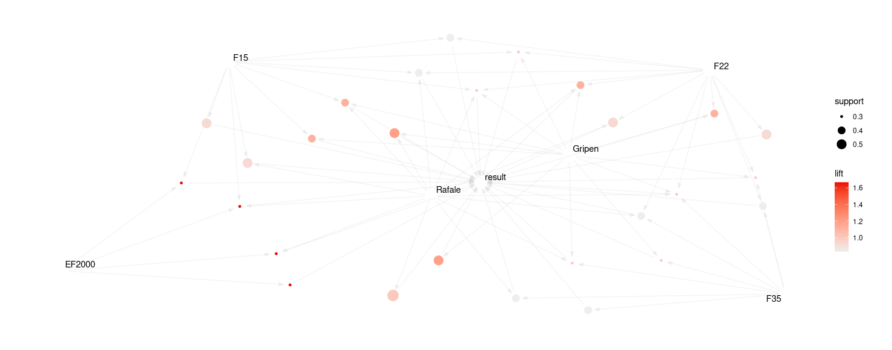

 


## Summary

- [Association Rules in R](#Association-Rules-in-R)
- [Instalation and Environment Preparation](#Instalation-and-Environment-Preparation)
- [Commands in R](#Commands-in-R)
- [Datas](#Datas)
- [Results](#Results)
- [Conclusion](#Conclusion)

## Association Rules in R

It is an example of code for assocation rules in R. It will be used libraries `arules` e `arulesViz`.

### Support

$$ \text{support}(A \rightarrow B) = \frac{A \cap B}{\text{T}} $$

Where A and B are items and _T_ is the total transactions. 

### confident

$$ \text{conf}(A \rightarrow B) = \frac{A \cap B}{\text{A}} $$

### lift

$$ \text{lift}(A \rightarrow B) = \frac{conf(A \cap B)}{\text{sup(B)}} $$

$$ \text{lift}(A \rightarrow B) = \frac{sup(A \cap B)}{\text{sup(A) * sup(B)}} $$

## Instalation and environment preparation

In case the libraries do not have been installed use the follow commands: 

```R
> install.packages("arules")
> install.packages("arulesViz") \n 
> install.packages("arulesViz", repos = "https://mhahsler.r-universe.dev")
> devtools::install_github("mhahsler/arulesViz").
``` 
Maybe you could install also using the command: library("devtools")
```R
> install_github("mhahsler/arulesViz")
```

Do not forget to install Linux library libglpk-dev by command:
```bash
> sudo apt-get install libglpk-dev
```

## Commands in R

```R
library(arules)
library(arulesViz)
```

```R
###Airplanes used in exercise
F35 <- c(1, 1, 1, 1, 1, 1, 0, 1, 0, 1)
F22 <- c(1, 1, 1, 1, 1, 1, 0, 1, 1, 1)
F18 <- c(1, 0, 1, 0, 1, 0, 0, 1, 0, 1)
F16 <- c(1, 1, 0, 1, 0, 1, 0, 1, 0, 0)
F15 <- c(1, 1, 0, 1, 1, 1, 1, 1, 1, 1)
EF2000 <- c(0, 1, 0, 1, 0, 0, 1, 0, 0, 0)
Gripen <- c(1, 0, 1, 1, 0, 1, 1, 0, 1, 1)
Mirage2000_5 <- c(1, 0, 0, 0, 1, 1, 1, 1, 0, 0)
Panavia_Tornado <- c(1, 0, 0, 0, 1, 0, 1, 0, 1, 0)
Rafale <- c(1, 1, 1, 1, 1, 1, 1, 1, 1, 1)  #where 1 is presence and 0 absent

#campaign results of all exercises involving all forces
result <- c(0, 1, 1, 1, 0, 0, 1, 0, 1, 1) #where 1 e victory e 0 e fail
```

Creating a data frame with all vectors
```R
resAndfighters <- cbind(F35, F22, F18, F16, F15, EF2000, Gripen, Mirage2000_5, Panavia_Tornado, Rafale, result)
```

Targeting "rules" because we want to extract all complete association rules. Support and confidence specified in apriori function are the minimal needed to all complete associations 
```R
rules <- apriori(resAndfighters, parameter = list(support = 0.3, confidence = 0.5, target = "rules"))
```

In general teh first lines are empty lines. Inspect shows the analysis and plot show the association from arulesViz
```R
rulesV1 <- rules[10:length(rules)]
###############################################################################################
inspect(rulesV1, ruleSep = "-->", itemSep = " && ", setStart = "", setEnd = "", linebreak = FALSE)
###############################################################################################
plot(rulesV1, main = NULL)
```

For complete code and example click [here](https://github.com/paulopimenta6/ph_codes/tree/master/R/regrasDeAssociacao/regrasAssociacao01/src)
 
## Datas

Data used is just an example of binary numbers in a fake join air forces war game operation including the main current aircrafts. 

## Results

|    LHS   |   RHS    | Support  |Confidence|   Lift   |  Count   |
|----------|----------|----------|----------|----------|----------|
|  EF2000  |  Result  |   0.3    |   1.00   |   1.66   |    3     |
|  Gripen  |  Result  |   0.5    |   0.71   |   1.90   |    5     |
|   F35    |  Result  |   0.4    |   0.50   |   0.83   |    4     |
|   F22    |  Result  |   0.5    |   0.55   |   0.92   |    5     |
|   F15    |  Result  |   0.5    |   0.55   |   0.92   |    5     |
|  Rafale  |  Result  |   0.6    |   0.60   |   1.00   |    6     |


|    LHS   |   RHS    | Support  |Confidence|   Lift   |  Count   |
|----------|----------|----------|----------|----------|----------|
|  Result  |  EF2000  |    0.3   |   0.50   |   1.66   |    3     |
|  Result  |  Gripen  |    0.5   |   0.83   |   1.19   |    5     |
|  Result  |    F35   |    0.4   |   0.66   |   0.83   |    4     |
|  Result  |    F22   |    0.5   |   0.83   |   0.92   |    5     |
|  Result  |    F15   |    0.5   |   0.83   |   0.92   |    5     |
|  Result  |  Rafale  |    0.6   |   1.00   |   1.00   |    6     |

<p align="center">
  
</p>

## Conclusion

Rafale (LHS) participate in more NATO exercises than others, but its confident is lower than Gripen. Although Gripen's lift is greater than Rafale. This first analysis show us that Gripen has a strong relation with victory (lift of 1.90):  _"if Gripen particpates, then it will be a victory"_, however Rafale has an independent relation, so participating or not victory or fail would happen. Remembering in this case we'll seeing: 

$$ \( Aircraft \rightarrow Result \) $$ 

where A is the aircraft and B the win or lose scenario.

In other view: _"if Result then aircraft"_ then we have a different analysis poiting Rafale with a greater confident than Gripen, although Gripen still continue with a great lift and small coeficient comparing to Rafale. 

$$ \( Result \rightarrow Aircraft \) $$ 

So, Gripen could show if it participates in a NATO exercise victory will happen, but remembering it is one of many analysis and not a unique truth. 

## References

> Agrawal, R., & Srikant, R. (1994, September). Fast algorithms for mining association rules. In Proc. 20th int. conf. very large data bases, VLDB (Vol. 1215, pp. 487-499).

> Uma Breve Introdução à Mineração de Dados: Bases Para a Ciência de Dados, com Exemplos em R. Novatec, 2021. ISBN-10: 6586057507.

> Grolemund, Garrett. R Para Data Science: Importe, arrume, transforme, visualize e modele dados. ISBN: 978-85-508-0324-1.

> Bruce, Peter, and Andrew Bruce. Estatística Prática para Cientistas de Dados. Alta Books, April 2019. ISBN: 9788550806037.
