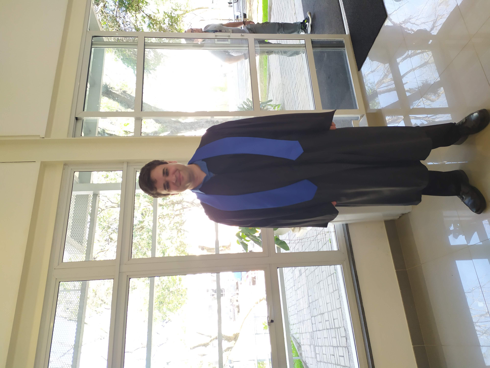
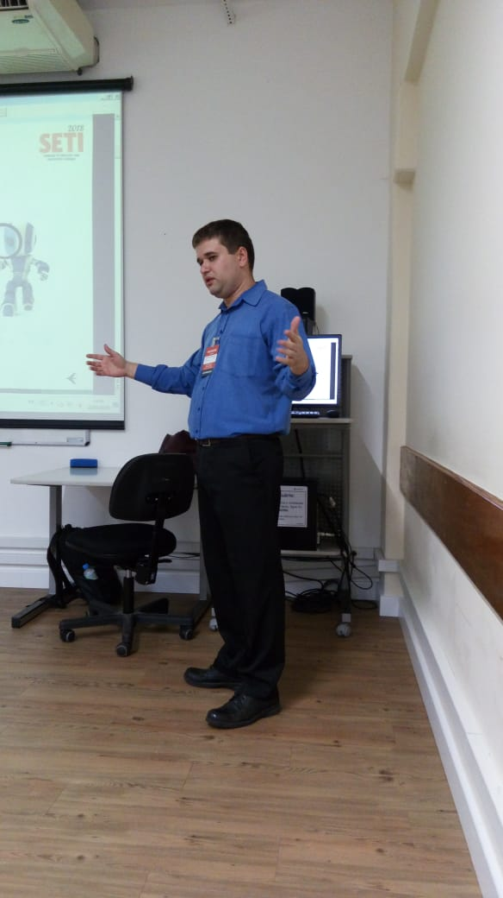

## About me

### Quem é Paulo Pimenta?

Iniciei meus estudos na UERJ-Rio em Estatística (IME-UERJ), ciência a qual sou apaixonado, mas devido aos problemas que havia naquela época na universidade optei por prestar vestibular novamente e para outros estados. Passei para a prestigiada Universidade de São Paulo e me formei em Meteorologia (IAG-USP).

Ao contrário do que todos pensam Meteorologia é um curso de ciências exatas e possui uma grade focada nas áreas de matemática, computação, estatística e física. Ao longo do curso fiz estágios na universidade e fui bolsista PIBIC.

  
   
  <em>Minha releeitura feita por mim após assistir "Vidas ao vento" de Hayao Myazaki</em>

  
   
  <em>Minha formatura na USP em 2019</em>

Durante o final de curso pude trabalhar com modelagem de dispersão de fluidos do CMAS (RLINE) o qual apliquei alguns casos teste para o meu TCC. Naquele momento era preciso ter o processador de dados e o pré-processador. Iniciei um estágio, o qual fui efetivado, na ATECH, uma empresa do grupo Embraer. Fui desenvolvedor de sistemas trabalhando na nova geração do sistema de controle de tráfego aéreo, assim como na produção de automação de testes. Tive a chance de atuar na área de negócios e na célula de inovação tecnológica.

  
   
  <em>Apresentando em um congresso de engenharia sobre automações de testes usando Python</em>

