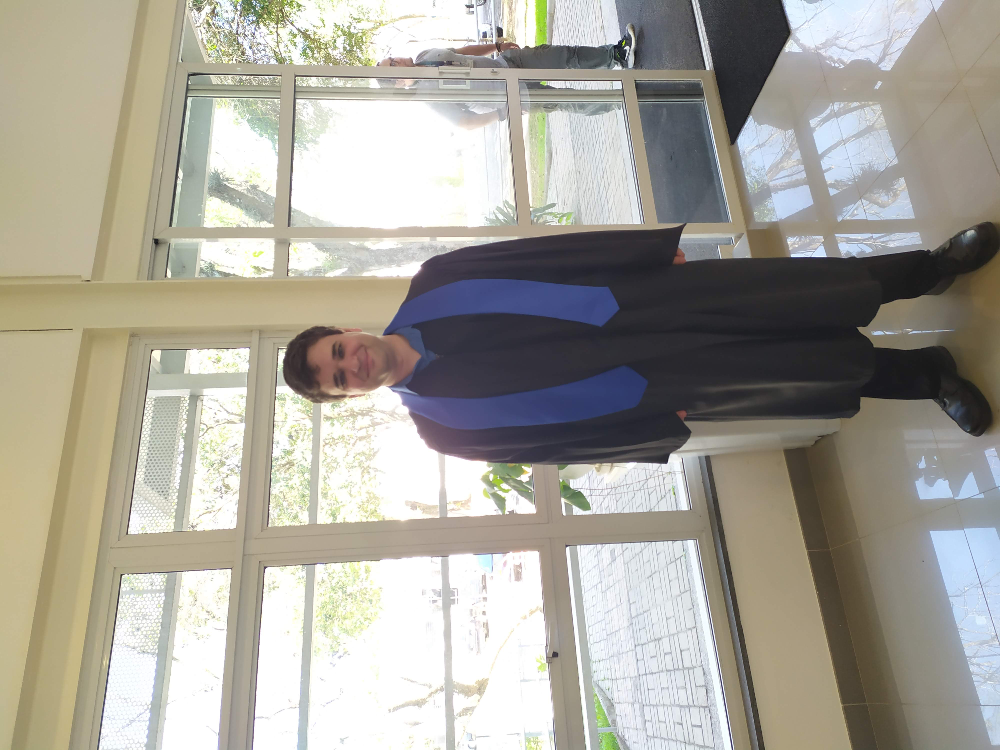
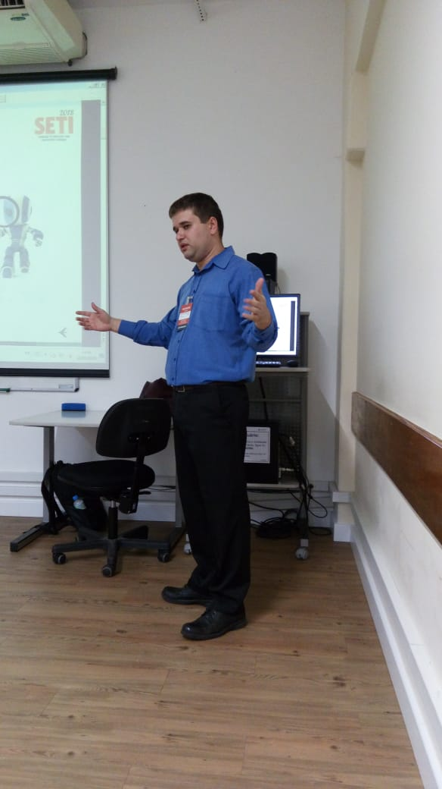

<p align="center">
  <a href="https://github.com/paulopimenta6">
    
  </a>
  <a href="https://www.linkedin.com/in/paulo-henrique-pimenta/">
    
  </a>
  <a href="https://www.instagram.com/paulopimenta6/">
    
  </a>
  <a href="https://www.youtube.com/@paulopi997">
    
  </a>
  <a href="https://500px.com/p/paulopimenta6?view=photos">
    
  </a>
  <a href="mailto:paulopimenta1850@gmail.com">
    
  </a>
</p>

<p align="center">
  
  
  
  
  
  
  
</p>

<p align="center">
  
</p>

---

<br>

<p align="center">
  
</p>

<br>

---

### 🧬 Perfil

```r
# carregando bibliotecas
library(tidyverse)
library(patchwork)

profile <- tibble(
  nome      = "Paulo Henrique Pimenta",
  origem    = "São Gonçalo, RJ",
  residencia = "São Paulo, SP",
  formacao  = "Meteorologia — USP (IAG)",
  pos      = "Mestrado em Medicina (Estatística Aplicada)",
  area     = "Depto. de Nefrologia",
  foco     = "Ciência de Dados · Estatística · ML · Dev"
)

profile |> glimpse()
```

```
#> Observations: 1
#> Variables: 7
#> $ nome       <chr> "Paulo Henrique Pimenta"
#> $ origem     <chr> "São Gonçalo, RJ → São Paulo, SP"
#> $ formacao   <chr> "Meteorologia — IAG‑USP"
#> $ pos        <chr> "Mestrado em Medicina — Estatística Aplicada à Nefrologia"
#> $ foco       <chr> "Ciência de Dados · Estatística · Machine Learning · Desenvolvimento"
```

---

### 🎓 Formação

| Período | Curso | Instituição |
|---------|-------|-------------|
| 2017–2019 | **Meteorologia (Bacharelado)** | **IAG‑USP** |
| 2024–presente | Ciência de Dados (2ª graduação) | — |
| 2026–presente | **Mestrado em Medicina** | **Depto. de Nefrologia — Estatística Aplicada** |

> A Meteorologia na USP tem grade de exatas: matemática, física, computação e estatística. Fui bolsista **PIBIC** e meu TCC envolveu modelagem numérica de dispersão atmosférica (CMAS/RLINE em Fortran).
>
> Hoje, no mestrado, aplico métodos estatísticos e computacionais à **pesquisa clínica em nefrologia** — conectando modelagem, análise de dados e saúde.

---

### 🔬 Galeria

<div align="center">
  <table>
    <tr>
      <td align="center">
        <br>
        <sub><em>Releitura de "Vidas ao Vento" (Miyazaki)</em></sub>
      </td>
      <td align="center">
        <br>
        <sub><em>Formatura na USP — 2019</em></sub>
      </td>
      <td align="center">
        <br>
        <sub><em>Congresso de engenharia — automação de testes com Python</em></sub>
      </td>
    </tr>
  </table>
</div>

---

### 🧠 O Que Ando Fazendo

Meus projetos atuais orbitam as interseções entre **estatística**, **computação** e **ciência de dados**:

| Domínio | Atividades |
|---------|------------|
| 📊 **Estatística Aplicada** | Métodos inferenciais, modelos não paramétricos, análise de sobrevivência, testes de hipótese aplicados à pesquisa clínica |
| 🤖 **Machine Learning** | Classificação, regressão, predição, reconstrução de dados — em Python e R |
| ☕ **Java** | Sistemas, APIs, arquitetura, boas práticas de OOP |
| 🐍 **Python / R** | Data wrangling, visualização, modelagem, automação |
| 🗃️ **SQLite** | Bancos relacionais embarcados para protótipos e ferramentas locais |

---

### 🌱 Interesses Pessoais

|  |  |
|--|--|
| 📚 **Estudo autodirigido** | Aprendizado contínuo como motor de crescimento |
| 📐 **Origami** | Paciência, precisão e raciocínio espacial |
| 🎨 **Desenho** | Expressão criativa e observação |
| 📸 **Fotografia** | Eternizar momentos — [500px](https://500px.com/p/paulopimenta6?view=photos) |
| 📖 **Leitura** | Não-ficção, ciência, filosofia |
| 🎮 **Videogame** | Fã da Nintendo — design, narrativa, arte |
| 🥋 **Judô** | Disciplina, força, cultura japonesa |

<div align="center">
  <br>
  <br>
  <sub><em>Iguaba Grande, Região dos Lagos (RJ) — clique fotográfico</em></sub>
</div>

---

### 🌐 Onde Me Encontrar

| Plataforma | Link |
|------------|------|
| 💼 **LinkedIn** | [linkedin.com/in/paulo-henrique-pimenta](https://www.linkedin.com/in/paulo-henrique-pimenta/) |
| 📸 **Instagram** | [@paulopimenta6](https://www.instagram.com/paulopimenta6/) |
| 📘 **Facebook** | [facebook.com/paulo.h.pimenta](https://web.facebook.com/paulo.h.pimenta/) |
| 🏞️ **500px** | [500px.com/p/paulopimenta6](https://500px.com/p/paulopimenta6?view=photos) |
| 🎥 **YouTube** | [@paulopi997](https://www.youtube.com/@paulopi997) |
| 💻 **GitHub** | [github.com/paulopimenta6](https://github.com/paulopimenta6/) |
| ✉️ **Email** | paulopimenta1850@gmail.com |

---

<br>

<p align="center">
  
</p>

<p align="center">
  <sub><i>"Beyond the mean, there's always a distribution."</i></sub>
</p>