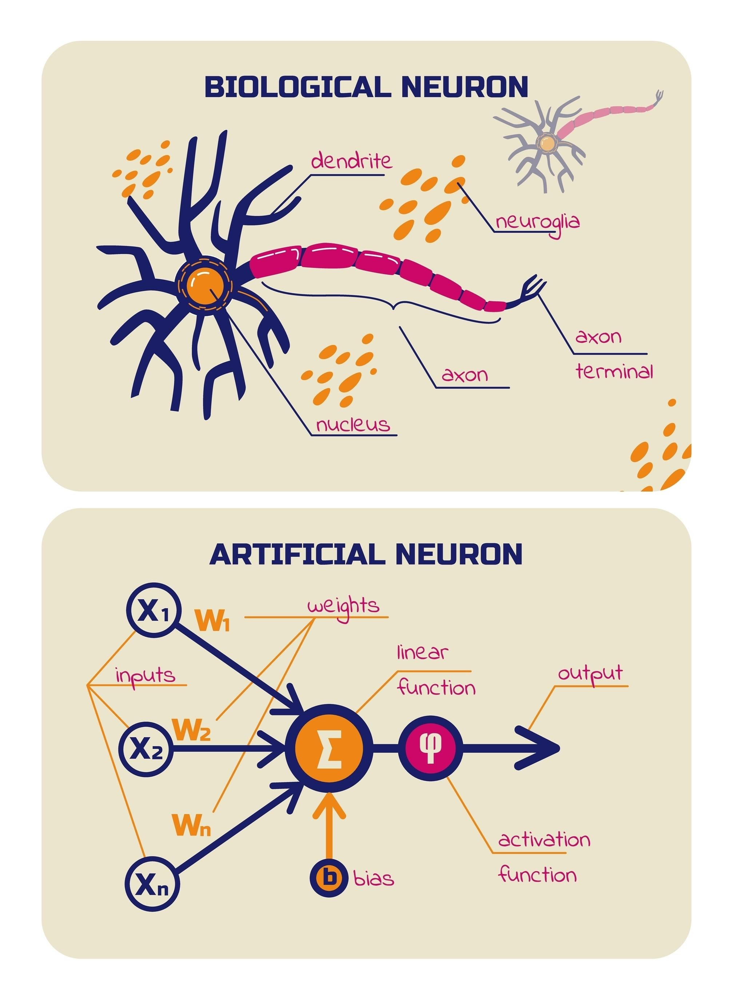

# Tutorial: Redes Neurais Artificiais do Zero

### Baseado na obra de David Kopec \| Implementação em Python

Este projeto é uma implementação didática e pura em Python de uma **Rede Neural Artificial (ANN)** do zero, sem o uso de _frameworks_ de aprendizado de máquina como TensorFlow ou PyTorch. O objetivo é focar nos **fundamentos matemáticos** e na **arquitetura de código** que regem o funcionamento de uma rede neural.

Este guia serve como material de apoio para estudantes e desenvolvedores que desejam entender a implementação de uma **Rede Neural Artificial (ANN)** construída puramente em Python, focando nos fundamentos matemáticos, estatísticos e na arquitetura de código, sem o uso de frameworks externos.

A implementação é baseada nos conceitos apresentados no livro *Classic Computer Science Problems* de David Kopec.

------------------------------------------------------------------------

## Sumário

1.  [Arquitetura e Componentes](#1-arquitetura-e-componentes)
    *   [1.1. O Neurônio (`Neuron`)](#11-o-neurônio-neuron)
    *   [1.2. A Camada (`Layer`)](#12-a-camada-layer)
    *   [1.3. A Rede (`Network`)](#13-a-rede-network)
2.  [Matemática e Funções Auxiliares](#2-matemática-e-funções-auxiliares)
3.  [Treinamento e Aprendizado](#3-treinamento-e-aprendizado)
    *   [3.1. Feedforward](#31-feedforward)
    *   [3.2. Backpropagation](#32-backpropagation)
4.  [Estrutura do Código](#4-estrutura-do-código)
5.  [Como Executar os Exemplos](#5-como-executar-os-exemplos)
6.  [Referências](#6-referências)

---

## 1. Arquitetura e Componentes

O projeto segue uma arquitetura modular, onde cada elemento fundamental da rede neural é representado por uma classe ou módulo Python.

### 1.1. O Neurônio (`Neuron`)

Cada neurônio recebe dados, processa-os e decide o quanto "disparar" de sinal para o próximo.


A unidade básica de processamento. Cada neurônio é responsável por:
*   Armazenar seus **pesos** (`weights`) e **viés** (implícito no cálculo do produto escalar com um viés de entrada, ou como parte dos pesos, dependendo da implementação exata, mas o código foca em pesos e um `output_cache`).
*   Realizar a **combinação linear** (produto escalar) das entradas com seus pesos.
*   Aplicar a **função de ativação** (Sigmoide) ao resultado.
*   Armazenar o **delta** de erro para a fase de *backpropagation*.


### 1.2. A Camada (`Layer`)

Uma camada é uma coleção de neurônios que operam em paralelo. A classe `Layer` gerencia:
*   A criação e inicialização dos neurônios.
*   A propagação dos sinais de entrada para todos os neurônios da camada.
*   O cálculo dos deltas de erro para a fase de *backpropagation* (métodos `calculate_deltas_for_output_layer` e `calculate_deltas_for_hidden_layer`).

### 1.3. A Rede (`Network`)

A classe `Network` é o orquestrador principal, responsável por:
*   Definir a **estrutura da rede** (número de camadas e neurônios em cada uma).
*   Gerenciar a sequência de camadas.
*   Implementar os métodos de **treinamento** (`train`) e **validação** (`validate`).
*   Propagar o sinal de entrada através de todas as camadas (`outputs`).

## 2. Matemática e Funções Auxiliares

O módulo `util.py` contém as funções matemáticas essenciais para o funcionamento da rede:

| Função | Descrição | Fórmula Matemática |
| :--- | :--- | :--- |
| `dot_product` | Calcula o produto escalar entre dois vetores (entradas e pesos). | $z = \sum_{i} (x_i \cdot w_i)$ |
| `sigmoid` | Função de ativação utilizada para "esmagar" o valor de saída do neurônio para um intervalo entre 0 e 1. | $S(x) = \frac{1}{1 + e^{-x}}$ |
| `derivative_sigmoid` | Derivada da função Sigmoide, crucial para o cálculo do gradiente no *backpropagation*. | $S'(x) = S(x) \cdot (1 - S(x))$ |
| `normalize_by_feature_scaling` | Função de pré-processamento de dados que normaliza cada coluna do *dataset* para o intervalo $[0, 1]$. | $X_{norm} = \frac{X - X_{min}}{X_{max} - X_{min}}$ |

## 3. Treinamento e Aprendizado

O aprendizado da rede é baseado no algoritmo de **Backpropagation**, que ajusta os pesos para minimizar o erro entre a saída prevista e a saída esperada.

### 3.1. Feedforward

A fase de propagação direta (`outputs` em `Network`) é o processo de levar a entrada através da rede, camada por camada, até a saída final. O resultado de uma camada serve como entrada para a próxima.

### 3.2. Backpropagation

A fase de propagação reversa (`backpropagate` em `Network`) é o coração do aprendizado e envolve os seguintes passos:

1.  **Cálculo do Erro:** O erro é calculado na camada de saída.
2.  **Propagação do Erro:** O erro é propagado de volta, da camada de saída para as camadas ocultas.
3.  **Cálculo dos Deltas:** Para cada neurônio, é calculado o **delta** (a contribuição do neurônio para o erro total), usando a derivada da função de ativação.
4.  **Atualização dos Pesos:** Os pesos são ajustados na direção oposta ao gradiente do erro, multiplicados pela **Taxa de Aprendizado** (`learning_rate`).

$$
w_{\mathrm{novo}} = w_{\mathrm{antigo}} + (\mathrm{learning\ rate} \cdot \delta \cdot \mathrm{output\ cache})
$$

## 4. Estrutura do Código

O projeto está organizado da seguinte forma:

```text
ann/
├── Core/
│   ├── layer.py      # Implementa a Camada
│   ├── network.py    # Implementa a Rede Neural (Orquestrador)
│   ├── neuron.py     # Implementa o Neurônio
│   └── util.py       # Funções matemáticas e de pré-processamento
├── examples/
│   ├── iris_test.py  # Exemplo de classificação do dataset Iris
│   └── wine_test.py  # Exemplo de classificação do dataset Wine
└── README.md         # O README original (será substituído
``` 

## 5. Como Executar os Exemplos

Para testar a rede neural, você pode executar os exemplos de classificação inclusos:

1.  **Pré-requisitos:** Certifique-se de ter o Python e as libs necessárias instaladas, estas últimas se encontram no arquivo requirements.txt. O projeto utiliza apenas bibliotecas padrão (como `csv` e `typing`). É aconselhável ter um ambiente Python para este projeto. A criação é simples e usa os seguintes comandos:

\`\`\`bash
mkdir ~/envs
python3 -m venv ~/envs/positron
source ~/envs/positron/bin/activate
\`\`\`

e para instalar pacotes básicos use os comandos:

\`\`\`bash
pip3 install --upgrade pip
pip3 install numpy pandas matplotlib seaborn scikit-learn
\`\`\`

2.  **Execução:** Navegue até a pasta `ann/examples` e execute o arquivo desejado.

**Exemplo: Classificação do Dataset Iris**

\`\`\`bash
cd ~/python/ANN   # diretório que contém a pasta 'ann'
~/envs/positron/bin/python -m ann.examples.iris_test
\`\`\`

O script `iris_test.py` carrega o dataset Iris, normaliza os dados, treina a rede com 140 amostras por 50 épocas e testa a acurácia com as 10 amostras restantes.

## 6. Referências

Este projeto é uma implementação prática dos conceitos de redes neurais multicamadas com backpropagation, inspirada no trabalho de:

*   **[Kopec, David.](https://classicproblems.com/)** *Deep Learning from Scratch: Building with Python from First Principles*. Manning Publications, 2019. (Referência principal para a arquitetura e lógica de implementação).